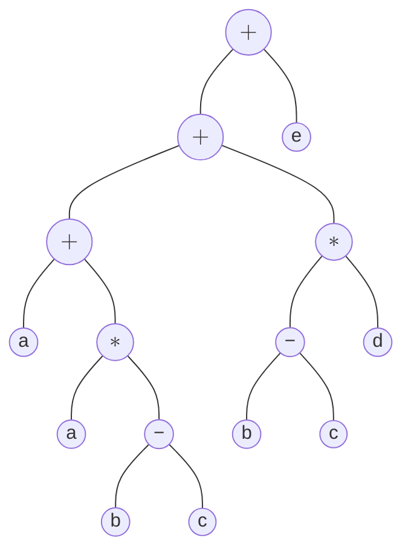

### Question 1
**Consider the following arithmetic expression:**  

$$
\begin{aligned}
a+a \times(b-c)+(b-c)\times d+e
\end{aligned}
$$  

###### a. Show the *Abstract Syntax Tree (AST)* for the given expression and write the three-address code for the expression. <span style="float: right; ">[5]</span>  
**Ans:** 


*Fig: Abstract Syntax Tree*

> [!warning]+
> While drawing AST, ignore the arrow directions.

Three Address Code:  
```
t1 = b - c
t2 = a * t1
t3 = a + t2
t4 = b - c
t5 = t4 * d
t6 = t3 + t5
t7 = t6 + e
```

###### b. Translate the given expression into *Quadruples* and *Triples*.<span style="float: right; ">[5]</span>  
**Ans:**   
***Quadruples***  

| $index$ | $op$ | $arg_{1}$ | $arg_{2}$ | $result$ |
| ------- | ---- | --------- | --------- | :------: |
| 0       | `-`  | `b`       | `c`       |   `t1`   |
| 1       | `*`  | `a`       | `t1`      |   `t2`   |
| 2       | `+`  | `a`       | `t2`      |   `t3`   |
| 3       | `-`  | `b`       | `c`       |   `t4`   |
| 4       | `*`  | `t4`      | `d`       |   `t5`   |
| 5       | `+`  | `t3`      | `t5`      |   `t6`   |
| 6       | `+`  | `t6`      | `e`       |   `t7`   |

***Triples***

| $index$ | $op$ | $arg_{1}$ | $arg_{2}$ |
| ------- | ---- | --------- | --------- |
| 0       | `-`  | `b`       | `c`       |
| 1       | `*`  | `a`       | 0         |
| 2       | `+`  | `a`       | 1         |
| 3       | `-`  | `b`       | `c`       |
| 4       | `*`  | 3         | `d`       |
| 5       | `+`  | 2         | 4         |
| 6       | `+`  | 5         | `e`       |
###### c. Construct a *Directed Acyclic Graph (DAG)* using *value-number method* for the given expression.<span style="float: right; ">[6]</span>  
**Ans:** 

###### d. What are the advantages of using indirect triples over triples in intermediate code representation. <span style="float: right; ">[4]</span>  
**Ans:** 

### Question 2
Consider the following Syntax Directed Definition.