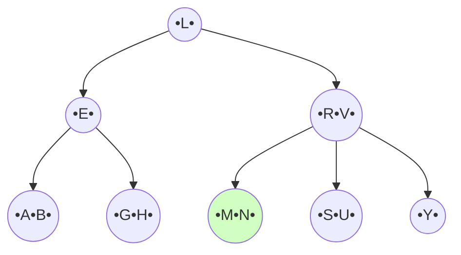
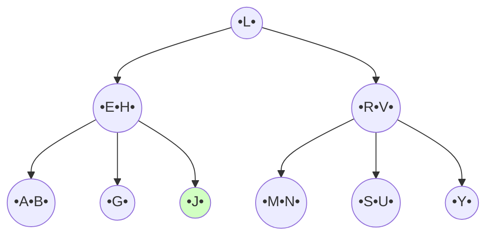
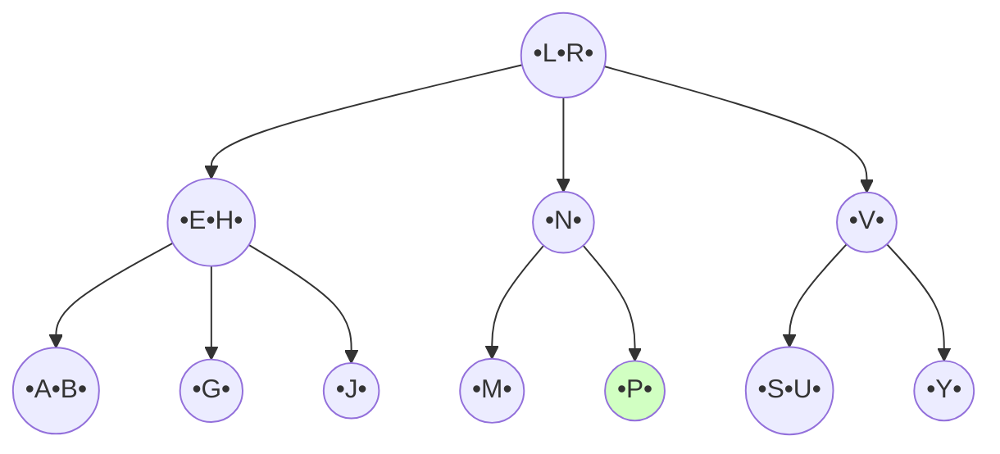
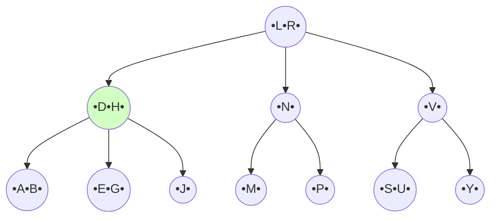
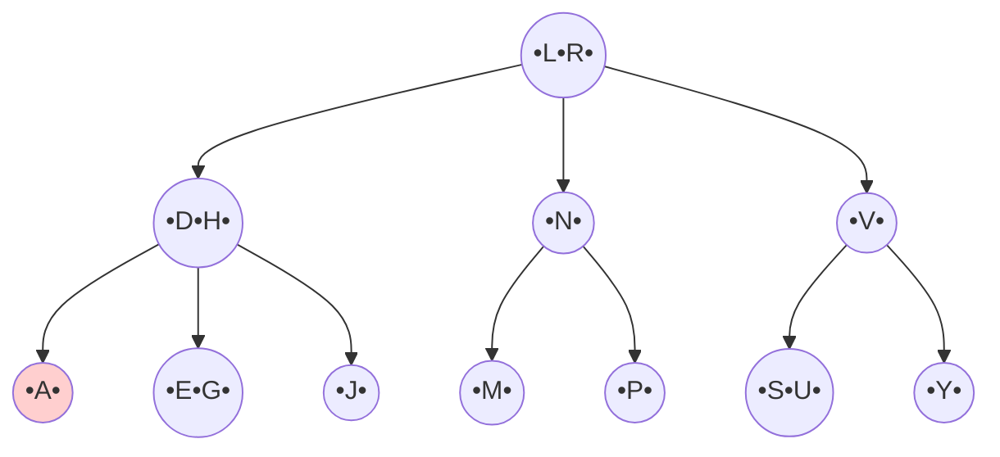
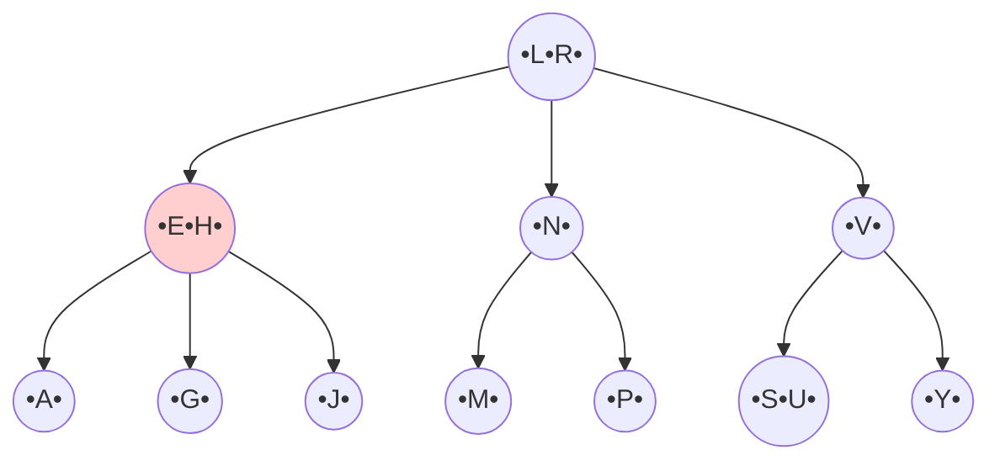
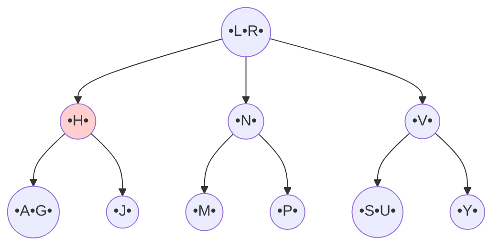
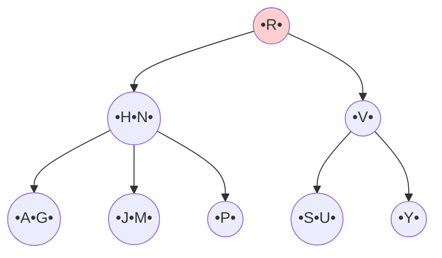

# B-Tree Index Files

A B-Tree is a balanced tree data structure commonly used in database indexing to improve data access speeds. It serves as a mechanism to locate records efficiently within a file. Like other index files, it consists of index entries containing a search-key and a pointer.

> [!info]+
> There are 3 types of B Tree i.e. Standard B Tree, B* Tree and B+ Tree. We will be focusing on Standard B Tree here.
## Properties

1. No node has more than $M$ children.  
2. Every node except for the root and the terminal node has at least $\lceil M/2 \rceil$.  
3. The root, unless the tree only has one node, has at least two children.  
4. All terminal nodes appear on the same level, that is, are the same distance from the root.    
5. A non-terminal node with k children contain $K-1$ record and a terminal node contains at least $\lceil M/2 \rceil-1$ and at most $[M-1]$ records.  

## Operations
Standard operations performed on B-Trees include insertion and deletion, which must maintain the structural properties listed above.

> [!example]+
> 
> Perform the following operations in the following B Tree with Order, $M=3$
> 1. Insert $M, J,P, D$
> 2. Delete $B, D, E, L$
> ```mermaid
> graph TD
> L((•L•))
> E((•E•))
> RV((•R•V•))
> AB((•A•B•))
> GH((•G•H•))
> N((•N•))
> SU((•S•U•))
> Y((•Y•))
> L --> E
> L --> RV
> E --> AB
> E --> GH
> RV --> N
> RV --> SU
> RV --> Y
> ```

## Solution
For, Order $M=3,$  
1. Root Child  
	- $min=2$  
	- $max=M=3$  
2. Internal node Child  
	- $min=\lceil M /2 \rceil=2$  
	- $max=3$  

### Insert M
$M$ goes between $L$ and $N$ (Lexicographical order). Insert into leaf $[N] → [M, N]$


### Insert J
$J$ goes between $H$ and $L$. Insert into leaf $[G, H]$, making it $[G, H, J]$. Since this node now has 3 keys (overflow for $M=3$), we split it.

### Insert P
$P$ goes between $N$ and $R$. Insert into leaf $[M, N]$, making it $[M, N, P]$. This causes overflow, so we split and push $N$ up and push $R$ to the root.

### Insert D
$D$ goes between $B$ and $E$. Insert into leaf $[A, B]$, making it $[A, B, D]$. So we push $E$ to the leaf node and replace it with $D$.

### Delete B
$B$ is in the leaf node which has 3 children. So we can simply delete $B$ without violating the rules.

### Delete  D
$D$ is in internal node. So we delete $D$ from that node, replacing the space with $E$ from the leaf node.

### Delete E
$[E,H]$ is an internal node which has 3 child. We delete $E$ and merge $A$ and $G$ to $[A,G]$ to decrease the number of child.

### Delete L
$L$ is in the root node. So after deleting $L$, we merge $H$ and $N$ to $[H,N]$ to reduce the number of root child by 1 and redistribute the leaf nodes.

And this is the final B Tree after all the operation mentioned.