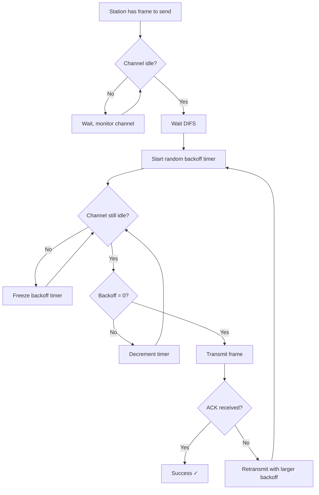

---
tags:
  - networking
  - wireless
  - MAC
  - CSMA-CA
  - WLAN
date: 2026-06-15
source: Chapter 14 – Wireless LANs (Kyung Hee University)
---
# Wireless LANs — IEEE 802.11

> [!abstract] Overview
> IEEE 802.11 is the standard suite for **Wireless Local Area Networks (WLANs)**. It defines specifications covering both the **Physical (PHY)** and **Data Link (MAC sublayer)** layers of the OSI model.

---

## Table of Contents

- [[#14.1 IEEE 802.11 Architecture]]
  - [[#Basic Service Set (BSS)]]
  - [[#Extended Service Set (ESS)]]
  - [[#Station Mobility Types]]
- [[#MAC Sublayer]]
  - [[#Why Not CSMA/CD?]]
  - [[#Hidden and Exposed Station Problems]]
  - [[#MACA — Multiple Access with Collision Avoidance]]
  - [[#Distributed Coordination Function (DCF)]]
  - [[#CSMA/CA Process]]
  - [[#Frame Exchange Timeline]]
- [[#Frame Format]]
  - [[#Control Frames]]
- [[#Physical Layer]]

---

## 14.1 IEEE 802.11 Architecture

### Basic Service Set (BSS)

> [!info] Definition
> A **BSS** is the fundamental building block of an 802.11 WLAN. It consists of:
> - One or more **wireless stations** (stationary or mobile)
> - Optionally, a **central base station** called an **Access Point (AP)**

| BSS Type | Description |
|---|---|
| **Ad Hoc Network** | BSS *without* an AP — standalone, cannot communicate with other BSSs |
| **Infrastructure Network** | BSS *with* an AP — can communicate via the AP |

> [!note]
> A BSS without an AP is called an **ad hoc network**; a BSS with an AP is called an **infrastructure network**.

---

### Extended Service Set (ESS)

> [!info] Definition
> An **ESS** is made up of **two or more BSSs**, each with its own AP, interconnected through a **Distribution System (DS)** — typically a wired LAN (e.g., Ethernet).

```
[ BSS1 ]──AP1──┐
               DS (Wired LAN)
[ BSS2 ]──AP2──┘
```

- Allows seamless roaming across BSSs
- Appears as a single logical network to higher layers

---

### Station Mobility Types

| Mobility Type | Description |
|---|---|
| **No-transition** | Stationary, or moves only within a single BSS |
| **BSS-transition** | Moves between BSSs within the **same ESS** |
| **ESS-transition** | Moves from one ESS to another (higher-layer sessions may break) |

---

## MAC Sublayer

> [!info]
> IEEE 802.11 defines the **MAC (Medium Access Control) sublayer** as part of the Data Link Layer. It governs how wireless stations share the radio medium.

The standard defines two MAC protocols:
1. **DCF** — Distributed Coordination Function *(contention-based)*
2. **PCF** — Point Coordination Function *(contention-free, optional)*

---

### Why Not CSMA/CD?

> [!warning] Wireless LANs cannot use CSMA/CD (used in wired Ethernet) for three reasons:

1. **Full-duplex collision detection is costly** — a station would need to transmit and sense the channel simultaneously, requiring expensive hardware and higher bandwidth.
2. **Hidden station problem** — a sender may not detect a collision occurring at the *receiver's* end.
3. **Signal fading over distance** — stations far apart may not hear each other's collisions due to signal attenuation.

**Solution → CSMA/CA** (Collision *Avoidance* instead of *Detection*)

---

### Hidden and Exposed Station Problems

#### Hidden Station Problem

```
A ─────── B ─────── C
```

- **A** and **C** are both in range of **B**, but *out of range of each other*
- If **A** is transmitting to **B**, **C** cannot hear **A** and may also start transmitting → **collision at B**
- **A** is "hidden" from **C**

> [!tip] Solution
> Use **RTS/CTS handshake** (CSMA/CA). The **CTS frame** broadcast by the receiver (**B**) is heard by **C**, silencing it.

#### Exposed Station Problem

```
A ─────── B ─────── C ─────── D
```

- **B** is transmitting to **A**
- **C** hears B's transmission and unnecessarily defers its own transmission to **D**
- **C** is "exposed" — it *could* have transmitted safely, but holds back

> [!note]
> The exposed station problem leads to **unnecessary channel under-utilization**. It is a known limitation of RTS/CTS-based approaches.

---

### MACA — Multiple Access with Collision Avoidance

> [!abstract] Protocol Steps

1. **Sender (B)** sends an **RTS (Request to Send)** to **Receiver (C)**
   - Includes the intended transmission duration
2. **Receiver (C)** replies with a **CTS (Clear to Send)**
   - Also includes the duration
3. **Stations overhearing RTS or CTS** set their **NAV (Network Allocation Vector)** — they know the channel will be busy and defer
4. **B transmits** data; **C sends ACK**

```
A        B        C        D
         ──RTS──►
         ◄──CTS──
[NAV]              [NAV]
         ──Data──►
         ◄──ACK──
```

> [!important] Key Insight
> - **Overhearing RTS** → station is near the sender → sets NAV to avoid interfering at receiver
> - **Overhearing CTS** → station is near the receiver → sets NAV to avoid its own transmission colliding
> - **Collision can only occur during the RTS/CTS handshake period**, not during data transfer

---

### Distributed Coordination Function (DCF)

> [!info]
> **DCF** is the primary, mandatory MAC protocol in 802.11. It uses **CSMA/CA with optional RTS/CTS**.

**Key Timers / Intervals:**

| Acronym | Full Name | Purpose |
|---|---|---|
| **DIFS** | Distributed InterFrame Space | Wait time before attempting transmission |
| **SIFS** | Short InterFrame Space | Short gap for ACK, CTS (higher priority) |
| **NAV** | Network Allocation Vector | Virtual carrier sense — countdown timer set from Duration field |

**DCF Operation:**
1. Station wants to transmit → senses channel
2. If **idle** for DIFS → start random **backoff timer**
3. If channel stays idle through backoff → **transmit** (optionally RTS first)
4. If channel is **busy** → defer and restart after DIFS + new backoff
5. On successful reception → receiver waits **SIFS** → sends **ACK**
6. No ACK received → **retransmit** (binary exponential backoff)

---

### CSMA/CA Process



---

### Frame Exchange Timeline

```
Sender:    ──DIFS──[RTS]──────────────────[DATA]──────────
                          SIFS    SIFS           SIFS
Receiver:               ──[CTS]──────────────────────[ACK]─
Others:                   ╔════════NAV══════════════╗
                          (defer — channel is busy)
```

- **SIFS < DIFS** → ensures ACKs and CTS frames have *priority* over new transmissions
- **NAV** is set based on the `Duration` field in RTS/CTS/Data frames

---

## Frame Format

```
┌────┬────┬──────┬──────┬──────┬──────┬────┬─────────┬─────┐
│ FC │ D  │ Addr1│ Addr2│ Addr3│  SC  │Addr4│  Body   │ FCS │
└────┴────┴──────┴──────┴──────┴──────┴────┴─────────┴─────┘
```

| Field | Full Name | Description |
|---|---|---|
| **FC** | Frame Control | Type, subtype, flags (To DS, From DS, Retry, etc.) |
| **D** | Duration | Sets the **NAV** value in microseconds |
| **Addr 1–4** | Addresses | Source, Destination, BSSID, varies by frame type |
| **SC** | Sequence Control | Frame sequence number for **flow/duplicate control** |
| **FCS** | Frame Check Sequence | CRC error detection |

---

### Control Frames

> [!info]
> Control frames manage channel access. Key subtypes (FC Type field = `01`):

| Subtype Value | Frame Type | Purpose |
|---|---|---|
| `1011` | **RTS** | Request to Send — initiates handshake |
| `1100` | **CTS** | Clear to Send — grants permission |
| `1101` | **ACK** | Acknowledgement — confirms receipt |
| `1010` | **PS-Poll** | Power Save Poll |

---

## Physical Layer

> [!info]
> The Physical Layer in 802.11 handles **bit-to-signal conversion** across various frequency bands and modulation schemes.

### ISM Band

**ISM = Industrial, Scientific, and Medical** — unlicensed frequency bands used by 802.11:

| Band | Frequency Range | Notes |
|---|---|---|
| **2.4 GHz** | 2.400 – 2.4835 GHz | Used by 802.11b/g/n; crowded (Bluetooth, microwaves) |
| **5 GHz** | 5.150 – 5.850 GHz | Used by 802.11a/n/ac; less congested, shorter range |

### Physical Layer Standards Summary

| Standard | Band | Max Speed | Modulation |
|---|---|---|---|
| **802.11b** | 2.4 GHz | 11 Mbps | DSSS |
| **802.11a** | 5 GHz | 54 Mbps | OFDM |
| **802.11g** | 2.4 GHz | 54 Mbps | OFDM |
| **802.11n** | 2.4/5 GHz | 600 Mbps | MIMO-OFDM |
| **802.11ac** | 5 GHz | ~3.5 Gbps | MU-MIMO OFDM |

---

## Key Concepts Summary

> [!summary] Quick Review

- **BSS** = basic cell; with AP = infrastructure; without = ad hoc
- **ESS** = multiple BSSs linked via wired distribution system
- **CSMA/CA** used instead of CSMA/CD — collision *avoidance*, not detection
- **RTS/CTS** handshake solves the **hidden station problem** via NAV
- **Exposed station problem** = unnecessary deferral; known limitation
- **DCF** is the mandatory contention-based MAC using CSMA/CA
- **NAV** = virtual carrier sense — countdown from Duration field in frames
- **DIFS > SIFS** — ensures control frames (ACK, CTS) get channel priority
- Collisions can only occur during the **RTS/CTS exchange**, not data phase

---

## Related Notes

- [[CSMA-CD vs CSMA-CA]]
- [[OSI Model — Data Link Layer]]
- [[Network Topologies]]
- [[Ethernet IEEE 802.3]]
- [[Collision Domains and Broadcast Domains]]

---

*Source: Chapter 14, Wireless LANs — Lecture by Prof. Choong Seon Hong, Kyung Hee University*
