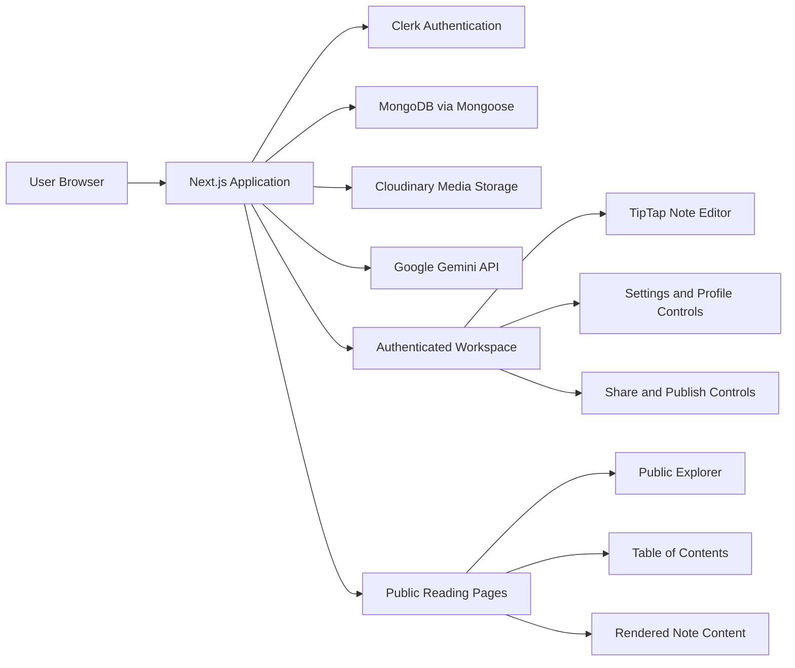
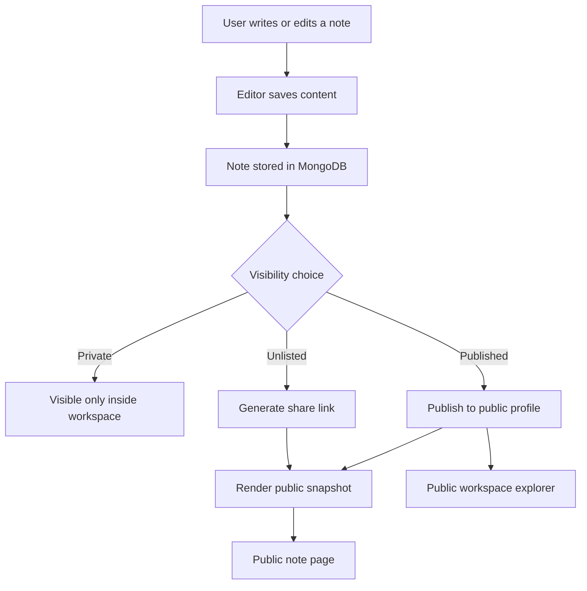
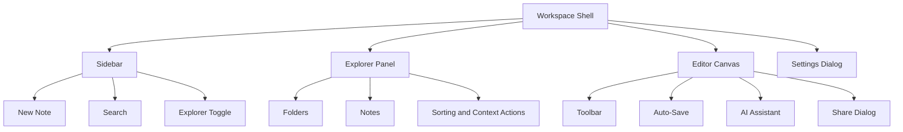

These Mermaid blocks are prepared for manual insertion into the final report if visual diagrams are required.

  

## 1. High-Level System Architecture

  

  

## 2. Note Publishing Flow

  

  

## 3. Main Workspace Structure

  

