### Lec-6: CRC
An informal, scenario-based brainstorming and design tool used in object-oriented software modeling.

**CRC Components**
1. **Class:** The object/components of the system.
2. **Responsibility:** he tasks or behaviors the class is accountable for.
3. **Collaborator:** Other classes it must work with (by requesting information or tasks) to fulfill its responsibilities.
   
>[!question] Why use CRC Cards?
>- They are portable. No computers are required so they can be used anywhere.
>- The allow the participants to experience first hand how the system will work. No computer tool can replace the interaction that happens by physically picking up the cards and playing the roll of that object. 
>- The are a useful tool for teaching people the object-oriented paradigm.

> [!note] Key things to remember
> 1. Class, Responsibility, Collaborators
> 2. Nouns $->$ Classes; Verb $->$ Responsibility
> 3. Object-Oriented Modeling

### Lec-7: Domain Modeling 
Building a simplified, conceptual model of real-world entities within a specific business problem domain using UML class diagrams.  
**Purpose of Modeling:** To visualize, specify, construct, and document system decisions, allowing developers to better understand the system.  

**Domain Model Notation**
- **Classes:** Represent real-world business entities rather than software components.
- **Attributes:** Represent the data held about those entities.
- **Associations:** Represent relationships between entities, typically named with verbs to read like a sentence.
- **Generalization:** Used to simplify the model structure by showing shared properties among different types of classes. 
- **Constraints:** Add specific conditions or business rules using attached notes for properties that cannot be shown graphically.
  
**Modelling Perspectives**
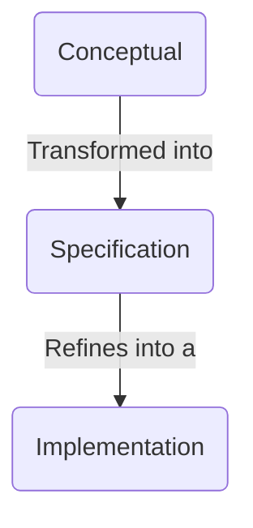

**Conceptual/Domain class diagram**
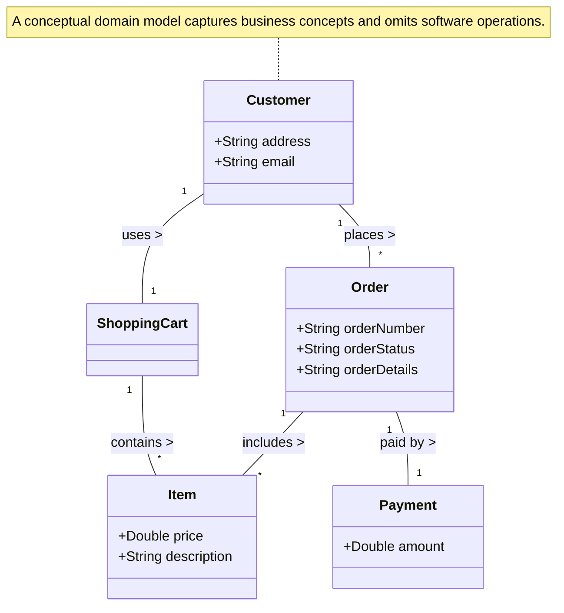

### Lec-8: Class Diagram
A static structure diagram that shows the building blocks of a system by depicting its classes, attributes, operations, and their interrelationships. It serves as a blueprint to plan and analyze a system before coding. 

##### 1. Class Compartments and Visibility
This demonstrates a standard class with private attributes (`-`) and public operations (`+`).

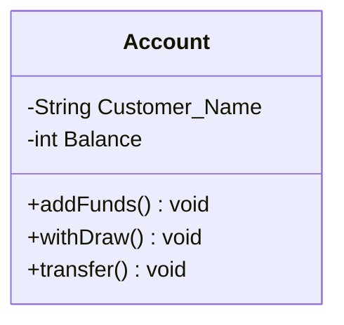

**Source Concept:** Derived from the standard UML 3-compartment notation (Name, Attributes, Operations) shown in the lecture.
##### 2. Association with Multiplicity and Roles
This represents two separate entities that have a logical relationship with explicit cardinality indicators.

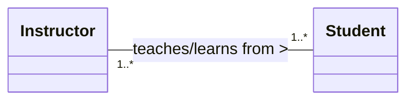
**Source Concept:** Models the bidirectional "teaches/learns from" relationship where multiple instructors interact with multiple students.

##### 3. Generalization (Inheritance)
This captures an "is a kind of" relationship where a specialized subclass inherits features from a broader superclass.

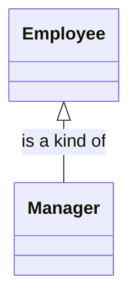
**Source Concept:** Models the rule where a `Manager` acts as a child class inheriting core structure from the `Employee` parent class.

##### 4. Aggregation (Independent Whole-Part)
This represents a weaker "has-a" relationship using a hollow diamond (`o--`), meaning child components survive if the parent container is deleted.

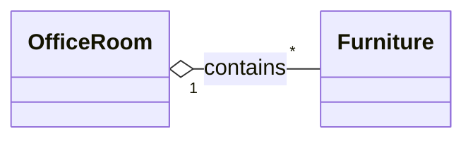
 **Source Concept:** Highlights that `Furniture` instances maintain a separate lifetime and do not cease to exist if the `OfficeRoom` is destroyed.

##### 5. Composition (Dependent Whole-Part)
This represents a highly restrictive relationship using a filled diamond (`*--`), where the lifecycle of the part is entirely tied to the parent composite.

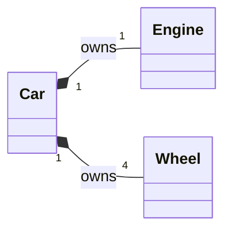

**Source Concept:** Recreates the final lecture case study where an `Engine` and `Wheel` cannot stand alone or function independently outside the lifecycle of the `Car`.

### Lec-9: Interaction Diagrams
Interaction diagrams model the dynamic behavior of a system by showing how a collection of objects collaborate and exchange messages to fulfill a use case scenario. 

**Primary forms:**
- **Sequence Diagrams:** Focus heavily on the **time-ordering** of messages.
- **Communication Diagrams:** Emphasize the **structural connections** and links between participating objects.

**Example 1: Sequence Diagram (Library Issue Book Use Case)**
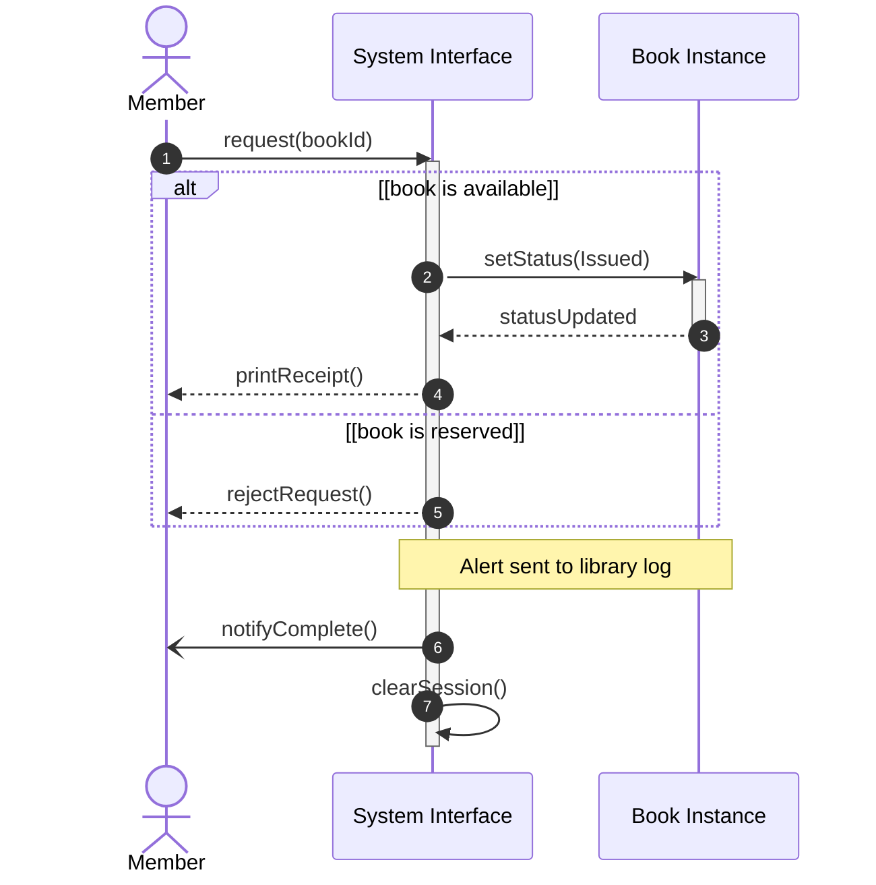

**Example 2: Communication Diagram**
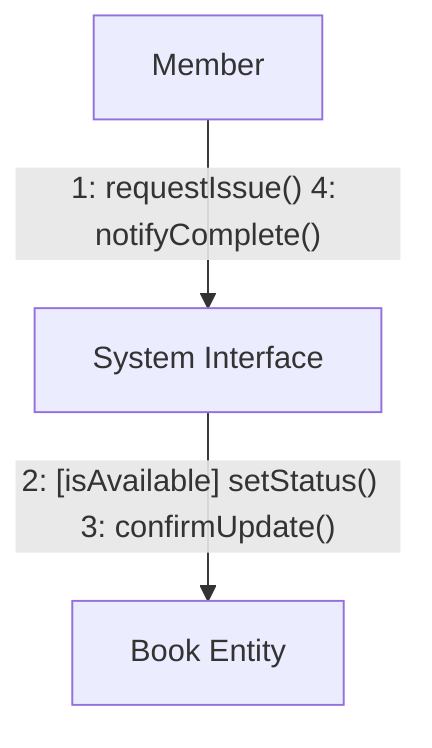

>[!question] Which one to use?
>- Choose sequence diagram when only the sequence of events needs to be shown and collaboration among the objects are priority.
>- Choose a communication diagram when the objects and their links facilitate understanding the interactions (you don’t have to put all objects at the top and make the lines all vertical or horizontal).

### Lec-10: Issue/Bug Tracking

While the term **"Bug"** is used informally to describe any software issue, engineering requires precise definitions to track issues effectively:

|**Term**|**Technical Definition**|**Concrete Example CSE3205_Lecture_10_MMA.ppt**|
|---|---|---|
|**Mistake**|A human action that produces an incorrect software design or code.|A programmer types `i = 1` instead of `i = 0` to start a loop.|
|**Fault / Defect**|A static flaw or incorrect definition in the code caused by a mistake.|The loop structurally skips the first element (index 0) of an array.|
|**Error**|An incorrect _internal state_ during execution resulting from a fault.|The loop counter skips index 0, causing a variable to hold an incorrect intermediate calculation.|
|**Failure**|An external, _observable violation_ of the system requirements.|The program displays a final count of `0` instead of `1` to the user.|

> **The Medical Analogy:** A patient's observable symptoms are **Failures**. The abnormal internal metrics found by medical tests (e.g., high blood pressure) are **Errors**. The underlying root illness is the **Fault**.

##### Quality Control: V&V, Testing, and Debugging
To ensure software is dependable, development relies on structured quality control mechanisms:
- **Verification vs. Validation (V&V):**
    - **Verification:** _"Are we building the product right?"_ Checks if the software conforms to the specifications established in the previous development phase.
    - **Validation:** _"Are we building the right product?"_ Evaluates the software at the end of development to ensure it complies with the user's actual intended needs.
- **Testing vs. Debugging:**
    - **Testing:** The intentional execution of a system under specific conditions to intentionally discover flaws and map gaps against requirements.
    - **Debugging:** The separate, corrective process of isolating the root cause of an identified flaw and repairing the code.

##### Traditional Testing Levels (The V-Model)
Testing mirrors development stages, scaling upwards from granular code to the holistic system:

- **Unit Testing:** The lowest level of testing; isolates and evaluates individual program units (e.g., single Java methods). Driven by the programmer (developer testing).
- **Module Testing:** Evaluates collections of related units assembled in a single component, file, or class in isolation. Driven by the programmer.
- **Integration Testing:** Assesses whether modules interact, communicate, and pass interfaces correctly. Assumes individual units already function correctly.
- **System Testing:** Tests the fully assembled system as a cohesive whole against its structural specifications. Focuses on high-level architectural flaws and is typically run by an independent test team.
- **Acceptance Testing:** Probes whether the final product fulfills the customer's business needs. Crucially requires the direct involvement of users or domain experts.

##### Object-Oriented (OO) Testing Framework
In object-oriented environments, testing shifts to accommodate class structures:
- **Intra-method:** Testing a single method individually.
- **Inter-method:** Testing pairs of interacting methods inside the same class.
- **Intra-class:** Testing an entire class by executing varying operational sequences of its calls.    
- **Inter-class:** Testing groups of multiple distinct classes working together.

### Lec-11: Black Box Testing
A testing technique where the internal structure, design, and implementation of the item being tested are completely unknown to the tester. 

**Two techniques:**
- **Equivalence Partitioning:** An input domain is divided into distinct classes of data called **equivalence partitions (or classes)**. The system will process all data elements within a single partition in an identical manner. Therefore, you only need to test **one value** from each partition to represent the entire group.
- **Boundary Value Analysis:** Complementary to Equivalence Partitioning, BVA shifts the focus directly to the **edges (boundaries)** of those partitions. Experience shows that a vast majority of programming mistakes occur at extreme input limits (e.g., using `<` instead of `<=`)

See [[CT-4]] for mathematical example solution. 
  
### Lec-12: White Box Testing
Unlike black box testing (which tests interfaces) , white box testing requires direct knowledge and access to the internal logic and source code of a component. It is typically executed at the **Unit Test level** by programmers who understand the code's internal mechanics. 

**Control Flow Graphs (CFG)**: An abstract representation of a program's execution paths.
- **Nodes**: Represent a sequential block of code statements containing no branches.
- **Directed Edges (Arcs)**: Represent the flow of control or an alternative execution branch.
- **Structure**: A valid CFG requires exactly 1 entry arc and 1 exit arc. **Logical Nodes** can be introduced as a junction point to close branches cleanly.

**Cyclomatic Complexity**: A metric that defines the number of independent paths required to thoroughly exercise every statement and branch in a CFG. 
**Independent Paths & Basis Path Set**: An independent path is any path from start to finish that introduces at least one completely unvisited edge. The _Basis Path Set_ is the maximal collection of these independent paths (note: this set is not unique).

**Example**
```js
function findMinimum(A, N) {
    // Node 1: Initialization
    let min = A[0];
    let I = 1;

    // Node 2: Loop Guard
    while (I < N) { 
        // Node 3: Conditional Branch
        if (A[I] < min) { 
            // Node 4: Condition Body
            min = A[I]; 
        }
        // Node 5: Post-body Increment
        I = I + 1; 
    }
    // Node 6: Post-loop Execution
    console.log(min); 
}
```

**CFG** 
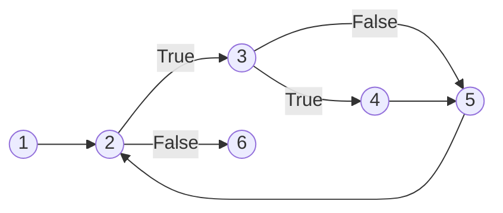
**Cyclomatic Complexity Calculation**
- **Predicate Nodes Method**: Count the nodes containing conditional splits (out-degree > 1) and add 1.
    - Predicate nodes = **2** (Node 2 and Node 3).
    - $\text{Complexity} = 2 + 1 = 3$.
- **Region Method**: Count the enclosed spatial areas plus the infinite outer region.
    - Enclosed loop areas = 2 (Region `2-3-4-5` and Region `2-3-5`).
    - Outermost open space = 1.
    - $\text{Complexity} = 2 + 1 = 3$. 

**Independent Paths (Basis Path Set)**
To satisfy a complexity of 3, we must construct 3 distinct paths where each path introduces at least one completely unvisited edge:
1. **Path 1 (Loop never runs):** `1 → 2 → 6`
2. **Path 2 (Loop runs, If-condition is False):** `1 → 2 → 3 → 5 → 2 → 6`
3. **Path 3 (Loop runs, If-condition is True):** `1 → 2 → 3 → 4 → 5 → 2 → 6`

>[!question] What is the use of the value of cyclomatic complexity?
>- **Defines the Test Target**: It specifies the exact number of independent test cases required to achieve complete statement and branch coverage.
>- **Acts as a Efficiency Sanity Check**: It provides a strict upper bound. If you design more test paths than this number to cover your code, your paths are structurally redundant or your calculation is incorrect.
>- **Enforces Test Maintainability**: It discourages wrapping multiple unvisited edges into single, overly complicated paths, ensuring individual test cases remain simple to design and debug.

### Lec-12b: JUnit Testing
Testing uncovers the presence of defects but cannot prove a system is entirely bug-free. The primary objective of testing is to purposefully force the software to fail. 
It is completely impractical to test every valid/invalid input combination and precondition due to spiraling costs and time constraints. Tesles rely instead on risk assessments and priorities to guide effort. 

>[!note] Definitions
>- **Test Case**: A structural artifact containing the necessary input values (test case values), precondition environmental states (prefix values), post-execution cleanup actions (postfix values), and expected results required to thoroughly execute and evaluate a component under test.
>- **Test Suite**: A logical collection or set of multiple individual test cases bundled together to cleanly organize, manage, and run test operations over specific modules or entire programs.

>[!question] Consider a function that takes two integers as parameters (named as a and b) and return the value of the reminder (a % b). Derive a test suite for this function consisting of 8 unique test cases.

**Test Suite for Remainder Function** 
```java
public class RemainderCalculator {
    /**
     * Calculates the remainder of the division of two integers.
     * @param a the dividend
     * @param b the divisor
     * @return the remainder (a % b)
     * @throws ArithmeticException if b is zero
     */
    public static int remainder(int a, int b) {
        return a % b;
    }
}
```

| **Test Case** | **Scenario Description**                    | **Input a** | **Input b** | **Expected Output**   |
| ------------- | ------------------------------------------- | ----------- | ----------- | --------------------- |
| **TC-01**     | Perfect Divisibility (Positive integers)    | `10`        | `5`         | `0`                   |
| **TC-02**     | Standard Remainder (Positive integers)      | `10`        | `3`         | `1`                   |
| **TC-03**     | Dividend is smaller than the Divisor        | `3`         | `7`         | `3`                   |
| **TC-04**     | Dividend is exactly Zero                    | `0`         | `5`         | `0`                   |
| **TC-05**     | Negative Dividend, Positive Divisor         | `-10`       | `3`         | `-1`                  |
| **TC-06**     | Positive Dividend, Negative Divisor         | `10`        | `-3`        | `1`                   |
| **TC-07**     | Both Dividend and Divisor are Negative      | `-10`       | `-3`        | `-1`                  |
| **TC-08**     | Division by Zero Error (Boundary Edge Case) | `5`         | `0`         | `ArithmeticException` |

### Lec-13: Software Architectural Pattern

##### Architectural Fundamentals
- **Software Architecture**: High-level blueprint defining subsystem structures, roles, and interactions. 
- **Cohesion (Intra-dependency)**: How focused a single unit's responsibilities are. Target: **Strong Cohesion**. 
- **Coupling (Inter-dependency)**: Level of reliance between different software units. Target: **Loose Coupling** to allow easy module replacement. 
- **The Trade-off**: Maximizing cohesion often increases components, which can inadvertently complicate coupling. 
##### Evolution Case Study: Minesweeper
- **System 1 (Monolith)**: Single class. Bad cohesion (UI, logic, storage mixed), deceptively zero coupling.
- **System 2 (Basic Split)**: Split into `MSGUI`, `Minesweeper`, and `MSStorage`. Good cohesion, but bad coupling because `MSGUI` directly triggers `MSStorage`.
- **System 3 (Decoupled)**: Linear flow ($\text{MSGUI} \rightarrow \text{Minesweeper} \rightarrow \text{MSStorage}$). UI changes or storage engine swaps do not impact other layers.

##### Three-Layer Architecture
System functions are separated into hierarchical layers to insulate against changing requirements:
1. **Presentation Layer**: User Interface and input handling.
2. **Application Layer**: Underlying core logic and execution.
3. **Storage Layer**: Relational databases, file networks, or state persistence.
##### Model-View-Controller (MVC) Pattern
An architectural design dividing data, display, and user interaction components:
- **Model**: Holds pure application data without any presentation layout logic.
- **View**: Visual presentation layer. Accesses model data but does not interpret its meaning or modify it directly.
- **Controller**: Intermediary coordinator. Listens to View interactions and maps them to method updates inside the Model. 


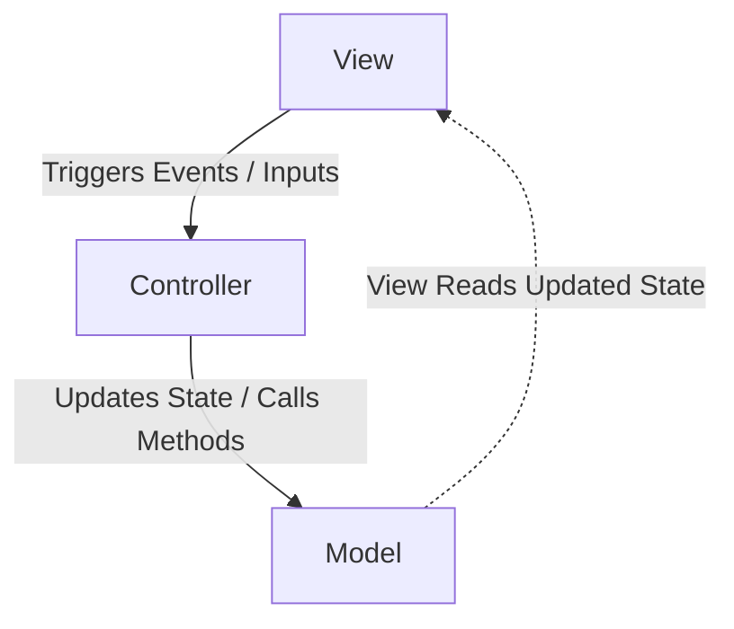

**Architectural Pattern Comparison**

| **Pattern**                                           | **Core Components**                                                                                    | **Data / Control Flow**                                                                                                       | **UI Synchronization**                                                                                            | **Primary Focus / Best Use Case**                                                                              |
| ----------------------------------------------------- | ------------------------------------------------------------------------------------------------------ | ----------------------------------------------------------------------------------------------------------------------------- | ----------------------------------------------------------------------------------------------------------------- | -------------------------------------------------------------------------------------------------------------- |
| **CQRS** _(Command Query Responsibility Segregation)_ | • **Commands** (Writes)<br><br>• **Queries** (Reads)<br><br>• **Read/Write Models**                    | **Segregated:** Writes follow a completely separate model/pipeline than reads.                                                | Typically asynchronous via events, message brokers, or projection updates.                                        | High-throughput architectures, Domain-Driven Design (DDD), and microservices with asymmetric read/write loads. |
| **ECB** _(Entity-Control-Boundary)_                   | • **Entity** (Data/Domain)<br><br>• **Control** (Use-case logic)<br><br>• **Boundary** (Interfaces/UI) | **Linear:** Boundary $\rightarrow$ Control $\rightarrow$ Entity. Direct separation of interface from application core.        | Explicit method calls and return values structured around specific use cases.                                     | Object-Oriented Analysis and Design (OOAD), system structuring during the UML/Use-Case phase.                  |
| **MVC** _(Model-View-Controller)_                     | • **Model** (Pure data)<br><br>• **View** (Presentation)<br><br>• **Controller** (Interactions)        | **Triangular:** View triggers Controller $\rightarrow$ Controller updates Model $\rightarrow$ View reads Model.               | View directly observes or reads data state from the Model.                                                        | Traditional web frameworks and monolithic applications seeking clean insulation from UI changes.               |
| **MVP** _(Model-View-Presenter)_                      | • **Model** (Data/Logic)<br><br>• **View** (Passive UI)<br><br>• **Presenter** (Middleman)             | **Bidirectional through Presenter:** View $\rightarrow$ Presenter $\leftrightarrow$ Model. View and Model are isolated.       | The Presenter explicitly pushes data updates to the View via an abstract UI interface.                            | Desktop and mobile client applications requiring highly isolated, unit-testable UI behaviors.                  |
| **MVVM** _(Model-View-ViewModel)_                     | • **Model** (Data/Logic)<br><br>• **View** (UI Layout)<br><br>• **ViewModel** (UI State wrapper)       | **Bi-directional via Binding:** View $\leftrightarrow$ ViewModel $\leftrightarrow$ Model. View binds properties to ViewModel. | **Automated Data Binding:** Two-way synchronization handles state updates seamlessly without manual intervention. | Modern event-driven frontend web and desktop frameworks (e.g., WPF, Angular, Vue, React).                      |
### Lec-14: Planning & Scheduling
**Critical Path Method (CPM)**: A network analysis technique used for planning and controlling complex but routine projects. It is specifically used when project task durations and resource requirements are known with certainty. 

**Four Key Elements**: CPM involves four core calculations: Critical Path Analysis, Float Determination, Early Start/Early Finish tracking, and Late Start/Late Finish tracking.
**Core Task Parameters**:
- **Earliest Start (ES)**: The earliest time a successor activity can begin once its predecessor finishes.
- **Earliest Finish (EF)**: The earliest a task can end, calculated as **ES + Task Duration**.
- **Latest Finish (LF)**: The latest time an activity can complete without pushing back the overall project deadline.
- **Latest Start (LS)**: The latest time a task can begin, calculated as **LF - Task Duration**.

 **Float / Slack Time**: The amount of time an individual activity can slide or be delayed before it causes a delay to the overall project. It is determined by calculating **LS - ES** (or **LF - EF**). Crucially, any task situated on the critical path has a float time of exactly zero.

>[!question] What is Critical Path?
>The **Critical Path** is the continuous sequence of dependent project activities that yields the longest combined duration from start to finish. It defines the minimum, absolute baseline duration required to execute the entire project.

>[!question] Why do we need Critical Path?
>Project managers utilize the critical path schedule to achieve three main objectives:
>- **Prevent Project Delays**: It explicitly flags zero-slack activities that must be completed on time. A delay in any task on this path instantly creates a cascading delay for the entire project.
>- **Identify Delay Flexibility**: It maps out exactly which non-critical tasks possess **float (slack)**, showing how long those specific items can be safely delayed without shifting the final completion date.
>- **Optimize Timelines**: It provides a mathematically verified calculation of the shortest possible execution schedule and determines the strict earliest/latest bounds for every task's start date.

### Lec-15: Software Usability
*Coming Soon, maybe :(*

### Lec-16: Documentation & Coding Standards

**Types of Documentation**

| Category      | Examples                                         |
| ------------- | ------------------------------------------------ |
| **Written**   | README, tutorials, reference guides, design docs |
| **Code**      | API docs, comments, example code, unit tests     |
| **Community** | Stack Overflow, blogs, forums, talks             |

**Big ones:** API-generated docs · project-level docs · how-to guides · user docs

**Coding Standards vs. Conventions**

- **Standards** → _must_ be followed (rules)
- **Conventions** → _should_ be followed (guidelines)

**Why?** Less bugs · easier maintenance · better teamwork · lower cost

**Naming Conventions _(C# / Microsoft guidelines)_**

```csharp
public class OrderService { }      // PascalCase → class, method, property
void processOrder() { }            // camelCase  → local var, parameter
private int _retryCount;           // _camelCase → private field
public interface IRepository { }   // I-prefix   → interface
```

**Layout & Comments**

```csharp
// Consistent indentation, one statement per line
if (x > 0)
{
    y = x * 2;
}

// Explain WHY, not WHAT
// Retry 3× — upstream API is flaky on first call
for (int i = 0; i < MAX_RETRIES; i++) { ... }

// Useless comment
counter++; // increment counter
```

**Member order:** Fields → Properties → Constructors → Public methods → Private methods

**XML Documentation (C#)**

```xml
/// <summary>Adds two integers and returns their sum.</summary>
/// <param name="a">Left operand.</param>
/// <param name="b">Right operand.</param>
/// <returns>Sum of a and b.</returns>
/// <remarks>Both operands must be non-negative.</remarks>
public static int Add(int a, int b) => a + b;
```

**Documentation Generators**

|Language|Tool|
|---|---|
|C#|DocFX, Sandcastle|
|Java|Javadoc|
|Python|Sphinx|

Parse code + doc-comments → auto-generate HTML/PDF API reference.

**Community Docs**
Bug trackers, Stack Overflow, blogs, forums, talks, conferences.

> Over time, community docs often become the _most valuable_ resource — users add vocabulary the original authors never thought of.

