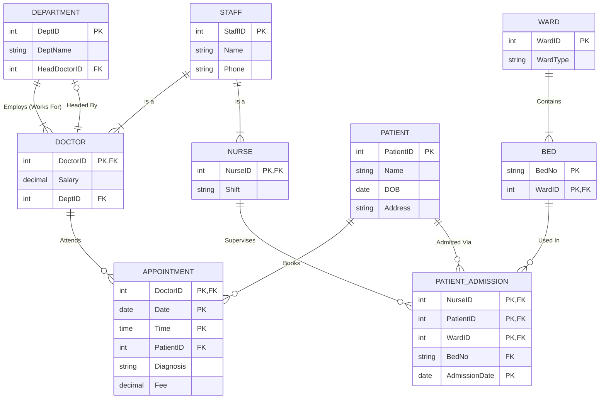

# DBMS Assignment 
### A. Conceptual Design - Enhanced Entity-Relationship (ER) Diagram (15 Marks)

### B. Logical Design - Relational Schema and Constraints (15 Marks)
##### 1. Relational Schema (5 Marks)
$$
\begin{aligned}
&STAFF(\underline{StaffID}, Name, Phone) \\
&DOCTOR(\underline{DoctorID}, Salary, DeptID) \\
&NURSE(\underline{NurseID}, Shift)\\
&DEPARTMENT(\underline{DeptID}, DeptName, HeadDoctorID)\\
&PATIENT(\underline{PatientID}, Name, DOB, Address)\\
&APPOINTMENT(\underline{DoctorID, Date, Time}, PatientID, Diagnosis, Fee)\\
&WARD(\underline{WardID}, WardType)\\
&BED(\underline{BedNo}, WardID)\\
&PATIENT\space ADMISSION(\underline{NurseID,PatientID, BedNo, WardID, AdmissionDate})\\
\end{aligned}
$$
##### 2. Constraint Specification (10 Marks)

**a. Table: Doctor**
- **Columns:** `DoctorID`, `Salary`, `DeptID`
- **Constraints:**
    - **PK:** `DoctorID` (Derived from Staff).
    - **FK:** `DoctorID` REFERENCES `Staff(StaffID)`
        - _ON DELETE CASCADE_ (If staff record is removed, doctor details should be removed).
        - _ON UPDATE CASCADE_.
    - **FK:** `DeptID` REFERENCES `Department(DeptID)`
        - _ON DELETE SET NULL_ (If dept closes, doctor still exists but is unassigned).
        - _ON UPDATE CASCADE_.
    - **CHECK:** `Salary > 0` (Salary must be positive).
    - **NOT NULL:** `Salary`, `DeptID`.

**b. Table: Appointment**
- **Columns:** `DoctorID`, `Date`, `Time`, `PatientID`, `Diagnosis`, `Fee`   
- **Constraints:**
    - **PK:** `(DoctorID, Date, Time)`    
        - _Justification:_ Ensures unique scheduling per doctor.    
    - **FK:** `DoctorID` REFERENCES `Doctor(DoctorID)`
        - _ON DELETE CASCADE_ (If doctor leaves, appointments are cancelled).    
        - _ON UPDATE CASCADE_.   
    - **FK:** `PatientID` REFERENCES `Patient(PatientID)`
        - _ON DELETE CASCADE_ (If patient profile is deleted, appointments are removed).
        - _ON UPDATE CASCADE_.
    - **NOT NULL:** `PatientID`, `Date`, `Time`.

**c. Table: Department**
- **Columns:** `DeptID`, `DeptName`, `HeadDoctorID`
- **Constraints:**
    - **PK:** `DeptID`.
    - **FK:** `HeadDoctorID` REFERENCES `Doctor(DoctorID)`
        - _ON DELETE SET NULL_ (If the head doctor leaves, the department remains without a head temporarily).    
        - _ON UPDATE CASCADE_.
    - **UNIQUE:** `HeadDoctorID` (A doctor can only head one department).
    - **NOT NULL:** `DeptName`.

**d. Table: Patient_Admission**
- **Columns:** `NurseID`, `PatientID`, `WardID`, `BedNo`, `AdmissionDate`
- **Constraints:**
    - **PK:** `(PatientID, WardID, NurseID, AdmissionDate)`
        - _Justification:_ Uniquely identifies each admission record. The same patient can be admitted multiple times to different beds or on different dates.
    - **FK:** `PatientID` REFERENCES `Patient(PatientID)`
        - _ON DELETE CASCADE_.
        - _ON UPDATE CASCADE_.
    - **FK:** `WardID` REFERENCES `Ward(WardID)`    
        - _ON DELETE CASCADE_ (If ward is demolished, admission records are invalid).        
        - _ON UPDATE CASCADE_.     
	- **FK**:  `NurseID` REFERENCES` Nurse(NurseID)`
		- *ON UPDATE CASCADE*
    - **NOT NULL:** `BedNo`, `AdmissionDate`.

### C. Analytical Critique and Decomposition (20 Marks)
##### i. Normalization Violation and Problems (15 Marks):
To determine the Candidate Key, we calculate the attribute closure of the potential determinants based on the provided Functional Dependencies (FDs).\
**Given FDs:**
1. $DoctorID \rightarrow DocName, DocSalary$ 
2. $PatientID \rightarrow PatientName$ 
3. $DoctorID, Date, Time \rightarrow PatientID, Diagnosis, Fee$

The attributes `DoctorID`, `Date`, and `Time` never appear on the right-hand side of any functional dependency. Therefore, they must be part of the Candidate Key.

**Closure Calculation $(DoctorID, Date, Time)^+$:**
- Start with $\{DoctorID, Date, Time\}$.
- Apply FD3: Adds $\{PatientID, Diagnosis, Fee\}$.
    - _Current Set:_ $\{DoctorID, Date, Time, PatientID, Diagnosis, Fee\}$
- Apply FD1 (since we have $DoctorID$): Adds $\{DocName, DocSalary\}$.
    - _Current Set:_ $\{DoctorID, Date, Time, PatientID, Diagnosis, Fee, DocName, DocSalary\}$
- Apply FD2 (since we have $PatientID$): Adds $\{PatientName\}$.
    - _Current Set:_ $\{All Attributes\}$.

**Conclusion:** The unique Candidate Key (CK) for relation R is:
$$
\begin{aligned}
CK = \{DoctorID, Date, Time\}
\end{aligned}
$$
**Five Super Keys (SK) in R**
A Super Key is any super set of the Candidate Key. Since the CK is $\{DoctorID, Date, Time\}$, any set containing these three attributes is a Super Key.
1. $\{DoctorID, Date, Time\}$ (The Candidate Key itself)
2. $\{DoctorID, Date, Time, PatientID\}$
3. $\{DoctorID, Date, Time, DocName\}$
4. $\{DoctorID, Date, Time, Diagnosis, Fee\}$
5. $\{DoctorID, Date, Time, PatientID, PatientName, DocName\}$

##### ii. Decomposition (5 Marks):
To ensure a lossless decomposition and eliminate anomalies, we must normalize the relation $R$. Currently, $R$ is in **1NF** but violates higher normal forms due to the following dependencies:
- **Partial Dependency (Violates 2NF):**
    $DoctorID \rightarrow DocName, DocSalary$
    (The non-prime attributes `DocName` and `DocSalary` depend only on `DoctorID`, which is a subset of the Candidate Key).
    
- **Transitive Dependency (Violates 3NF):**
    $PatientID \rightarrow PatientName$
    (The non-prime attribute `PatientName` depends on `PatientID`, which is not a Candidate Key).

**Step-by-Step Decomposition:**
1. **Decompose to remove Partial Dependency (Create Doctor Relation):**
    We isolate the doctor's details into a separate table referenced by `DoctorID`.
    - **R1 (Doctor):** $\{DoctorID, DocName, DocSalary\}$
    
2. **Decompose to remove Transitive Dependency (Create Patient Relation):**
    We isolate the patient's details into a separate table referenced by `PatientID`.
    - **R2 (Patient):** $\{PatientID, PatientName\}$
        
3. **Retain the Main Transaction Table (Create Appointment Relation):**
    The remaining attributes form the central fact table linking doctors, patients, and appointment details.
    - **R3 (Appointment):** $\{DoctorID, Date, Time, PatientID, Diagnosis, Fee\}$

**Final Lossless Decomposed Relations:**

| **Relation Name** | **Attributes**                                                | **Constraints**                                                               |
| ----------------- | ------------------------------------------------------------- | ----------------------------------------------------------------------------- |
| **Doctor**        | $\underline{DoctorID}, DocName, DocSalary$                    | **PK:** `DoctorID`                                                            |
| **Patient**       | $\underline{PatientID}, PatientName$                          | **PK:** `PatientID`                                                           |
| **Appointment**   | $\underline{DoctorID, Date, Time}, PatientID, Diagnosis, Fee$ | **PK:** `(DoctorID, Date, Time)` **FK**: `DoctorID` **FK**: `PatientID` |

