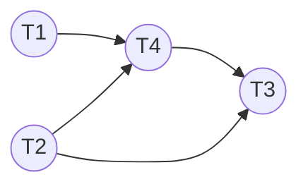
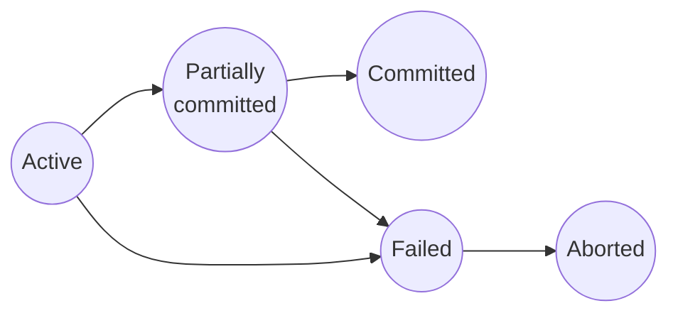

### Question 2
###### a. Consider the following relational schema for a restaurant database:<span style="float: right; ">13 </span>
$$
\begin{aligned}
&\text{resturant (res\_id, res\_name, res\_type, area, contact)} \\
&\text{menu (menu\_id, res\_id, item\_name, price)} \\
&\text{customer (cust\_id, cust\_name, phone, area)} \\
&\text{order (order\_id, cust\_id, res\_id, menu\_id, date, total)}
\end{aligned}
$$
Write a query in SQL for each of the following:  

**Ans:**
1. Find the name of restaurants who serves any type of 'soup' mentioned in the menu. <span style="float: right; ">03 </span>
```sql
SELECT res_name
FROM restaurant
NATURAL JOIN menu
WHERE item_name LIKE '%soup%'; 
```
2. Display the total number of orders placed, along with the total revenue generated by each restaurant.<span style="float: right; ">03 </span>
```sql
SELECT res_name, COUNT(order_id), SUM(total)
FROM resturant
NATURAL JOIN `order` 
GROUP BY res_name;
```
3. Create a view named _avg_price_ that displays the average price of menu items for each restaurant.<span style="float: right; ">03 </span>
```sql
CREATE VIEW avg_price AS
SELECT res_name, AVG(price) 
FROM restaurant
NATURAL JOIN menu
GROUP BY res_name;
```
4. Display the names of customers who ordered “chicken_curry” from “Indian” restaurants, along with the order date and total amount spent.<span style="float: right; ">04 </span>
```sql
SELECT cust_name, `date`, total
FROM restaurant 
NATURAL JOIN menu
NATURAL JOIN customer
NATURAL JOIN `order`
WHERE item_name = 'chicken_curry' AND res_type = 'Indian';
```
###### b. Imagine, you are tasked to control the access of users (students, teachers, chairman) to a relation containing the marks of this course according to the authorization as:
|   User   |  Class Test   |  Assignment   | Final Exam |
| :------: | :-----------: | :-----------: | :--------: |
| **Student**  |     View      |     View      | No access  |
| **Teacher**  | Update/Insert | Update/Insert |   Insert   |
| **Chairman** |     View      |     View      |    View    |

Provide a conceptual idea to implement the authorization in terms of privileges in SQL.  <span style="float: right; ">07 </span>

**Ans:**  To implement this securely and efficiently, we should not assign permissions to individual users directly. Instead, we create **Roles** (Student, Teacher, Chairman), assign specific privileges to these roles, and then add actual users to these roles.

We assume the relation is a table named `CourseMarks` with columns: `student_id`, `class_test`, `assignment`, and `final_exam`.  
1. **Student**
   ```sql
   CREATE ROLE Student;
   
   GRANT SELECT (student_id, class_test, assignment) 
   ON CourseMarks TO Student;
   ```
2. **Teacher**
   ```sql
   CREATE ROLE Teacher;
   
   GRANT INSERT (class_test, assignment, final_exam)
   ON CourseMarks TO Teacher;
   
   GRANT UPDATE (class_test, assignment)
   ON CourseMarks TO Teacher;
   
   GRANT SELECT ON CourseMarks TO Teacher;
   ```
3. **Chairman**
   ```sql
   CREATE ROLE Chairman;
   
   GRANT SELECT ON CourseMarks TO Chairman;
   ```
### Question 3
###### a. Consider the following relational schema for a restaurant database:<span style="float: right; ">14 </span>
$$
\begin{aligned}
&\text{user (user\_id, user\_name, email, address, contact)}\\
&\text{product (product\_id, product\_name, category, price, seller\_id)}\\
&\text{seller (sellet\_id, seller\_name, location, contact)}\\
&\text{order (order\_id, user\_id, product\_id, order\_date, quantity)}\\
&\text{review (review\_id, product\_id, user\_id, rating)}
\end{aligned}
$$
Write a relational algebra for each of the following:
1. Retrieve the product names, name of review, and the names of sellers whose products have been reviewed with a rating of 5. <span style="float: right; ">04 </span>  
   <br>
   $$
   \Pi_{\text{product\_name, user\_name, seller\_name}}\big(\sigma_{\text{rating=5}}(user\bowtie product\bowtie sell er\bowtie review)\big)
   $$
   <br>
2. Find the names of users who placed orders for products under the "Households" category, along with the product names and order date.<span style="float: right; ">04 </span>  
   <br>
   $$
   \Pi_{\text{user\_name, product\_name, order\_date}}\big(\sigma_{category=\text{"Households"}}(user\bowtie product\bowtie \text{order})\big)
   $$
   <br>
3. Find the names of seller and the details of the products they are selling at cost more than 100.<span style="float: right; ">03</span>  
   <br>  
   $$
   \Pi_{\text{seller\_name, product\_name, category, price}}\big(\sigma_{price>100}(product\bowtie sell er)\big)
   $$
   <br>
4. Display the names of users and their reviews for the products they have rated.<span style="float: right; ">04</span>  
   <br>
   $$
   \Pi_{\text{user\_name, product\_name, rating}}(user\bowtie product\bowtie review)
   $$
   <br>
###### b. Explain the concepts of *left outer join* and *right outer join* through an appropriate example. <span style="float: right; ">06</span>
**Ans:**  *Outer Join* is an extension of the *join* operation that avoids loss of information. It computes the join and then adds tuples in the other relation to the result of the join. Uses *null* to represent missing data. Let us consider two relation:  
1. **course**

| course_id | title       | dept_name  | credits |
| --------- | ----------- | ---------- | ------- |
| BIO-301   | Genetics    | Biology    | 4       |
| CS-190    | Game Design | Comp. Sci. | 4       |
| CS-315    | Robotics    | Comp. Sci. | 3       |
2. **prereq**  

| course_id | prereq_id |
| --------- | --------- |
| BIO-301   | BIO-101   |
| CS-190    | CS-101    |
| CS-347    | CS-101    |

**Left Outer Join**  
`course natural left outer join prereq`

| course_id | title       | dept_name  | credits | prereq_id |
| --------- | ----------- | ---------- | ------- | --------- |
| BIO-301   | Genetics    | Biology    | 4       | BIO-101   |
| CS-190    | Game Design | Comp. Sci. | 4       | CS-101    |
| CS-315    | Robotics    | Comp. Sci. | 3       | *null*    |

Here, *left outer join* took all the values from the left table `course` and displayed corresponding information of right table `prereq`. As there is no record of `CS-315` in `prereq` table, it displayed null in `prereq_id` column.  

**Right Outer Join**  
`course natural right outer join prereq`  

| course_id | title       | dept_name  | credits | prereq_id |
| --------- | ----------- | ---------- | ------- | --------- |
| BIO-301   | Genetics    | Biology    | 4       | BIO-101   |
| CS-190    | Game Design | Comp. Sci. | 4       | CS-101    |
| CS-347    | *null*      | *null*     | *null*  | CS-101    |

Here, *right outer join* took all the values from the right table `prereq` and displayed corresponding information of right table `course`. As there is no record of `CS-347` in `course` table, it displayed null in `title, dept_name & credits` column. 

### Question 4
###### a. A schedule `S`, consists of 4 transaction for 5 variables in total. Find the conflicting operation in `S` and test `S` for conflicting serializability through precedence graph. If it is serializable, the find the serialized order.<span style="float: right; ">10</span>
**The order of transaction in `S`:**  
$R_{1}(A),\space R_{2}(B),\space R_{3}(C),\space W_{1}(A),\space R_{4}(D),\space R_{2}(C),\space W_{2}(B),\space R_{3}(E),\space R_{4}(B),\space R_{1}(C),\space R_{2}(D),\space \\ W_{4}(D),\space R_{3}(B),\space R_{4}(A),\space W_{3}(B)$

Where, $R_{1}(Y)$ means *read* operation in variable $Y$ in Transaction $i$.  
$W_{1}(Y)$ means *write* operation in variable $Y$ in Transaction $i$.  

**Ans:** **Table view of Schedule `S`:**

$$
\begin{array}{|c|c|c|c|}
\mathbf{T_1} & \mathbf{T_2} & \mathbf{T_3} & \mathbf{T_4} \\ \\
\text{read(A)} & & & \\
& \text{read(B)} & & \\
& & \text{read(C)} & \\
\text{write(A)} & & & \\
& & & \text{read(D)} \\
& \text{read(C)} & & \\
& \text{write(B)} & & \\
& & \text{read(E)} & \\
& & & \text{read(B)} \\
\text{read(C)} & & & \\
& \text{read(D)} & & \\
& & & \text{write(D)} \\
& & \text{read(B)} & \\
& & & \text{read(A)} \\
& & \text{write(B)} & \\
\end{array}
$$

**Conflicting operation:**  
Two operations conflict if they belong to different transactions, access the same data item, and at least one of them is a `Write` operation. Based on the schedule $S$, the conflicting operations are:

|**Data Item**|**Operation 1 (Preceding)**|**Operation 2 (Succeeding)**|**Conflict Direction**|
|---|---|---|---|
|**A**|$W_1(A)$|$R_4(A)$|$T_1 \to T_4$|
|**B**|$W_2(B)$|$R_4(B)$|$T_2 \to T_4$|
|**B**|$W_2(B)$|$R_3(B)$|$T_2 \to T_3$|
|**B**|$W_2(B)$|$W_3(B)$|$T_2 \to T_3$|
|**B**|$R_2(B)$|$W_3(B)$|$T_2 \to T_3$|
|**B**|$R_4(B)$|$W_3(B)$|$T_4 \to T_3$|
|**D**|$R_2(D)$|$W_4(D)$|$T_2 \to T_4$|

> [!note]-
> Operations on C involve only Reads ($R_1, R_2, R_3$), so no conflicts exist for C.

**Precedence Graph Construction**  
**Edges:**  
1. $T_{1}\to T_{4}$
2. $T_{2}\to T_{4}$
3. $T_{2}\to T_{3}$
4. $T_{4}\to T_{3}$

> [!tip]-
> Only pick the unique edges from conflict direction.

**Graph:**  

Since the graph contains **no cycles** (it is a Directed Acyclic Graph), the schedule $S$ is **Conflict Serializable**.

**Serialized Order:** $T_1 \rightarrow T_2 \rightarrow T_4 \rightarrow T_3$

###### b. How can a *shadow-database* scheme be implemented to ensure the recoverability of the database?<span style="float: right; ">05</span>
**Ans:** The recovery-management component of a database system implements the support for atomicity and durability.  
**The *shadow-database* scheme:**
- Assume that only one transaction is active at a time.
- A pointer called db_pointer always points to the current consistent copy of the database.
- All updates are made on a shadow copy of the database, and db_pointer is made to point to the updated shadow copy only after the transaction reaches partial commit and all updated pages have been flushed to disk.
- In case transaction fails, old consistent copy pointed to by db_pointer can be used, and the shadow copy can be deleted.  
  
  ![[shadow-database.png]]
###### c. Illustrate the possible states of a transaction.<span style="float: right; ">05</span>
**Ans:**  


