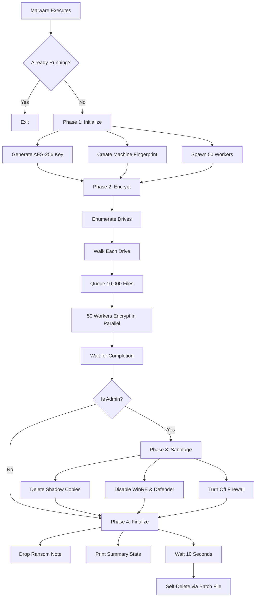
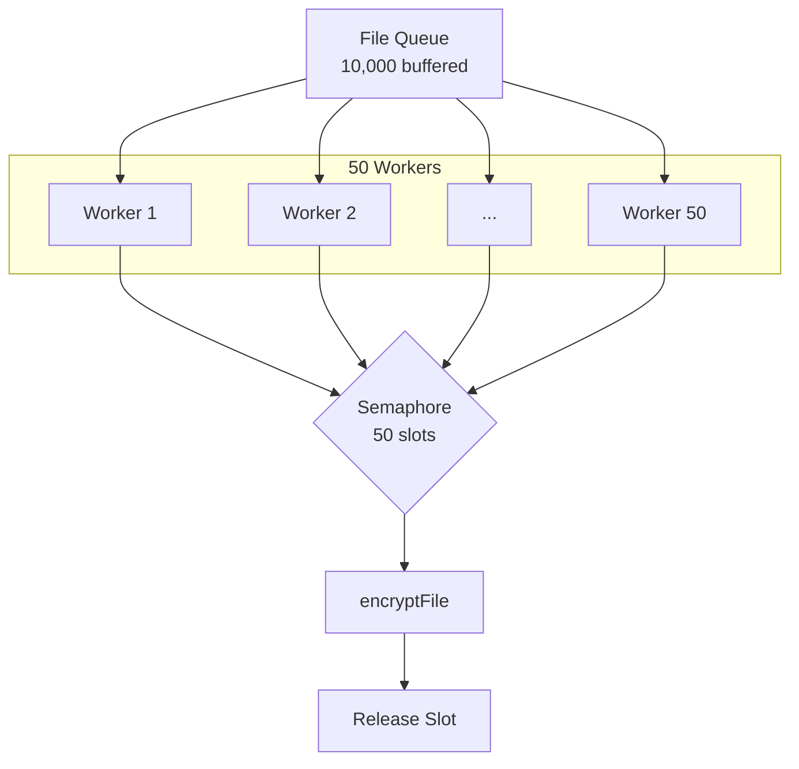
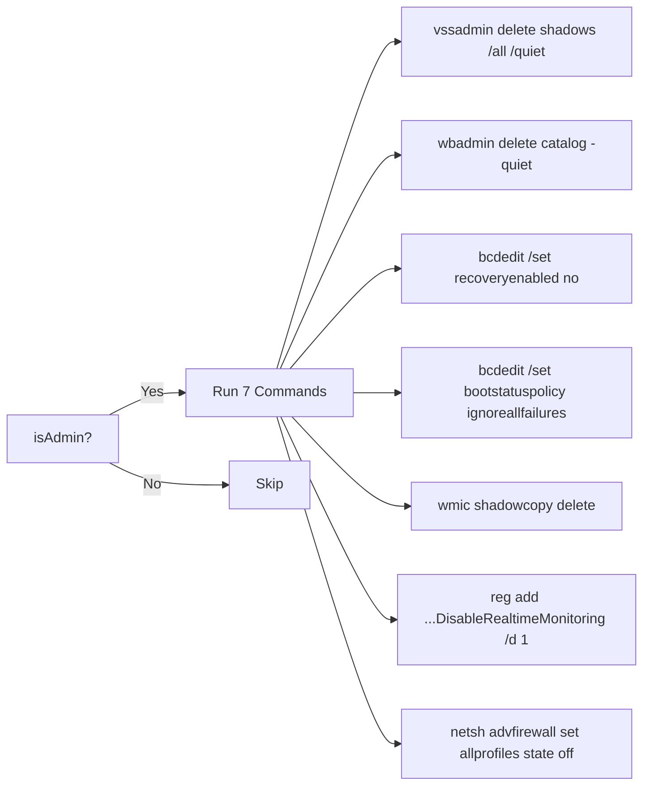

> **SHA256:** `12bba7161d07efcb1b14d30054901ac9ffe5202972437b0c47c88d71e45c7176`  
> **Language:** Go, 64-bit PE, ~4MB  
> **Encryption:** AES-256-CTR, `.tgbg` extension  
> **Contact:** `thegreenblood@proton.me`

>[!note] Decompiled Codes
> For decompiled source code retrieved from Ghidra, please refer to this Github repository → [greenblood-ransomware-analysis](https://github.com/towfiq-rakin/greenblood-ransomware-analysis) 
## At a Glance

I was handed a suspicious Windows executable, no metadata, no signature, just a 64-bit PE file. Before touching a debugger, I ran the simplest tool in the book: `strings`.

What jumped out immediately was **"Go build ID"** embedded right in the binary. This thing was written in Go, not the usual C/C++ payload. Even more interesting, it leaked its own source path: `/root/victims/ransom/daf/enc.go`. That's rare. Most malware authors strip debug symbols. This one didn't.

The strings also spilled its entire playbook: AES encryption, a `.tgbg` extension, commands like `vssadmin delete shadows`, an onion address, and two email addresses: `thegreenblood@proton.me` and `thegreenblood@onionmail.org`. We were looking at ransomware. And not a subtle one.

So I fired up Ghidra, installed the [**GoAnalyzerExtension**](https://github.com/mooncat-greenpy/Ghidra_GolangAnalyzerExtension) (essential for Go binaries, their calling convention and string layout is nothing like standard PE files), and started decompiling function by function. Here's everything I found

| Property             | Value                                |
| -------------------- | ------------------------------------ |
| Malware Family       | Green Blood / DAF                    |
| Serial Number        | `DAF-SN-1258745612548523`            |
| Source Path (leaked) | `/root/victims/ransom/daf/enc.go`    |
| Key Size             | 256-bit (32 bytes), fresh per victim |
| IV                   | 128-bit (16 bytes), fresh per file   |
| File Extension       | `.tgbg`                              |
| Ransom Note          | `!!!READ_ME_TO_RECOVER_FILES!!!.txt` |
| C2                   | Tor hidden service on port 8000      |

---

## Execution Flow



---

## Phase 1: Initialization

### What happens

1. **Mutex check** — creates `Global\GREENBLOOD_ENCRYPTOR_MUTEX_2A3B4C5D` to prevent double-runs
2. **Key generation** — `crypto/rand.Read()` generates 32 random bytes
3. **Machine fingerprint** — collects hostname, drive serials, MAC, Windows Product ID, BIOS UUID
4. **Recovery token** — derived from fingerprint for victim identification
5. **Worker pool** — 50 goroutines + 10,000-entry file queue

```go
// Simplified key generation
key := make([]byte, 32)
crypto/rand.Read(key)           // OS CSPRNG — unbreakable

// Simplified fingerprint
fingerprint := hostname + "||" + 
               driveSerials + "||" + 
               macAddress + "||" + 
               windowsProductId + "||" +
               biosUUID
machineID := hex(first32Bytes(fingerprint))
```

![[NewKeyManager.png]]

---

## Phase 2: Encryption

### Drive Discovery

The malware calls `GetLogicalDrives()` to get a bitmask of available drive letters, then `GetDriveTypeW()` for each to filter out non-local drives. Only fixed drives and removable drives are targeted — network shares are excluded entirely. For a typical workstation, this means `C:\` and possibly `D:\`.

### Directory Walking

Each drive is walked recursively in its own goroutine. As directories are discovered, the malware checks them against a hardcoded exclusion list of 14 system paths. The motivation is practical, not merciful, encrypting `C:\Windows` would crash the OS before the encryption could finish, and the malware needs the system running to complete its job.

```go
systemExclusions := map[string]bool{
    "C:\\Windows":              true,
    "C:\\Program Files":         true,
    "C:\\Program Files (x86)":  true,
    "C:\\ProgramData":           true,
    "C:\\Boot":                  true,
    "C:\\Recovery":             true,
    "C:\\System Volume Information": true,
    // ... 14 total
}
```

### File Targeting

The logic here is layered:
1. **Hard block:** Don't touch anything with "read_me" in the name
2. **Hard block:** Files with no extension at all
3. **Check blacklist:** If the extension is in `extensionsToSkip`, skip it
4. **Check whitelist:** If the extension is in `extensionsToEncrypt`, encrypt it
5. **Fallthrough:** If extension not in EITHER list but file > 100 bytes, encrypt anyway
6. **Catch-all:** Small, unidentified files are left alone

### Encryption Algorithm

The encryption is `AES-256` in CTR mode. A fresh 32-byte key is generated per victim via `crypto/rand.Read()`, and each file gets its own 16-byte random IV, also from the `CSPRNG`. The IV is written as the first 16 bytes of the `.tgbg` file, then the plaintext is streamed through `crypto/cipher.NewCTR` with a 1MB buffer. CTR mode means encryption and decryption are identical, just XOR the keystream with the data. The rename chain is atomic: `original → .bak, .tmp → .tgbg`, then delete `.bak`, so a crash mid-encryption leaves the original recoverable as the `.bak` file. Despite "`AES-CBC`" strings in the binary (from the `FIPS 140-3` self-tests), the actual call path in the decompiled code is `aes.NewCipher → cipher.NewCTR → StreamWriter.Write` — verified CTR, not CBC.


```go
// Simplified encryption
iv := make([]byte, 16)
crypto/rand.Read(iv)                         // new IV per file

block := aes.NewCipher(encryptionKey)        // AES-256
stream := cipher.NewCTR(block, iv)           // CTR mode
writer := cipher.StreamWriter{dstFile, stream}

buffer := make([]byte, 1MB)                  // 1 MB chunks
for { read(source, buffer); writer.Write(buffer) }

// Atomic rename: original → .bak → .tgbg → delete .bak
os.Rename(original, original+".bak")
os.Rename(original+".tmp", original+".tgbg")
os.Remove(original+".bak")
```

Skips files that are too large. `0xC80000000 = 53,687,091,200 bytes = exactly 50 GB.`

![[large-size.png]]


> [!warning] CTR, not CBC
> Despite `AES-CBC` strings appearing in the binary (from FIPS 140-3 self-tests), the actual encryption is **AES-256-CTR** — verified by the decompiled call chain:  
> `encryptFile → crypto/aes.NewCipher → crypto/cipher.NewCTR → StreamWriter.Write`

### Concurrency Model
The encryption engine uses Go's channels as a clean producer-consumer system. A file queue channel (buffered with 10,000 slots) decouples the directory walkers from the encryption workers, walkers push file paths in, workers pull them out. A worker pool channel (50 slots) acts as a semaphore, limiting concurrent encryption to exactly 50 files at any moment. A stop channel signals all workers to exit when encryption is complete.



```go
workerPool := make(chan struct{}, 50) // 50 concurrent encryptors
fileQueue := make(chan string, 10000) // 10,000 file paths queued
stopChan := make(chan struct{}) // shutdown workers
```

Each file gets up to **4 attempts** with exponential backoff (100ms × attempt number).

---

## Phase 3: System Sabotage

Only executes if the malware is running as administrator. The privilege check uses SID construction (`S-1-5-32-544`, the BUILTIN\Administrators group) with a `TokenIsElevated` fallback for UAC split tokens.



| # | Command | What It Destroys |
|---|---------|------------------|
| 1 | `vssadmin delete shadows` | Volume Shadow Copies (System Restore) |
| 2 | `wbadmin delete catalog` | Windows Backup history |
| 3 | `bcdedit recoveryenabled no` | Windows Recovery Environment |
| 4 | `bcdedit bootstatuspolicy` | Auto-repair on boot failure |
| 5 | `wmic shadowcopy delete` | Shadow Copies (second API) |
| 6 | `reg add DisableRealtimeMonitoring` | Windows Defender real-time protection |
| 7 | `netsh advfirewall state off` | Windows Firewall |

Decompiled view of the commands:  
![[disableRecovery.png]]

> [!warning] Ordering Bug
> Defender is disabled at step 6 — **after encryption finishes**. If Defender was going to catch the encryption, it already did in Phase 2. This should have run first.

---

## Phase 4: Finalization

### Ransom Note

A ransom note is written to the desktop as `!!!READ_ME_TO_RECOVER_FILES!!!.txt` and also placed in every directory that was traversed during encryption as `READ_ME_TO_RECOVER_FILES.txt`. The note includes the victim's recovery token, machine ID, the attacker's email addresses, and the all-important deadline: payment within 7 days, key destroyed after 21 days. It also lists every recovery method the victim might attempt and warns that each will cause permanent data loss — a deliberate psychological tactic to discourage experimentation.

![[readmetorecover.png]]

### Self-Delete

A running process cannot delete its own executable on Windows because the file is locked. The malware works around this by writing a batch script (`cleanup_greenblood.bat`) to the temp directory. After a 10-second countdown (giving the encryption process time to flush I/O and exit), it launches this script with the console window hidden. The script waits 5 seconds, then enters a retry loop that deletes the ransomware binary. Once the binary is gone, the script deletes itself. No trace of the malware remains on disk.


---

## Machine Fingerprint

The fingerprint is how the attackers identify a specific victim. It combines five data points:
- **Hostname** — the computer's network name
- **Drive serials** — volume serial number for every local drive (a 32-bit hex value assigned at format time)
- **MAC address** — the hardware address of the first physical network adapter
- **Windows Product ID** — from the registry, unique to the Windows installation
- **BIOS UUID** — queried through `wmic csproduct get uuid`, burned into the motherboard firmware

All five are joined into a single string separated by `||`, then the first 32 bytes of that string are taken (cycling from the beginning if the string is shorter than 32 bytes). The result is formatted as uppercase hex. This is what the victim must email to the attackers along with their recovery token to prove they are the legitimate owner of the encrypted machine.

---

## Key Data Structures

```c
struct EncryptionEngine {
    KeyManager  *keyManager;      // holds the AES key
    chan        *workerPool;      // semaphore: 50 slots
    WaitGroup   wg;               // waits for directory walkers
    WaitGroup   fileWg;           // waits for file workers
    struct {
        int64 encryptedFiles;     // success counter
        int64 encryptedBytes;     // bytes processed
        int64 failedFiles;        // errors
        int64 skippedFiles;       // excluded/skipped
    } stats;
    RWMutex     statsMutex;       // thread-safe stats
    chan        *fileQueue;       // 10,000 file paths
    chan        *stopChan;        // worker shutdown signal
};

struct KeyManager {
    []byte  encryptionKey;        // 32 bytes (AES-256)
    string  recoveryToken;        // victim ID for payment
    string  machineID;            // unique fingerprint
};
```

![[datastructure.png]]

---

## How Decryption Works

The attacker already has the key — it was exfiltrated to the C2 during Phase 2 (likely via the goroutine spawned at `main.main.func1`). Each `.tgbg` file contains its IV in the first 16 bytes. Decryption is identical to encryption (CTR is symmetric):

```
.tgbg file:  [16-byte IV] [ciphertext...]
                              │
AES-256(key) → CTR(IV) → XOR ┘ → plaintext
```

---

## Indicators of Compromise (IoCs)

#### Filesystem
- `*.tgbg` — encrypted files
- `!!!READ_ME_TO_RECOVER_FILES!!!.txt` — desktop ransom note
- `READ_ME_TO_RECOVER_FILES.txt` — directory ransom notes
- `cleanup_greenblood.bat` — self-deletion script
#### Mutex
- `Global\GREENBLOOD_ENCRYPTOR_MUTEX_2A3B4C5D`

#### Network
- `scbrksw5fgjtujc2ah42roo6bij2unr2tggfcynpbql5a7yp3s22taid.onion:8000`

#### Behavioral
- Mass file rename to `.tgbg`
- `vssadmin.exe delete shadows /all /quiet`
- `bcdedit.exe /set {default} recoveryenabled no`
- `netsh.exe advfirewall set allprofiles state off`
  
---
## What's Interesting

**Well done:**
- Go language — unusual for ransomware, harder to reverse without GoAnalyzerExtension
- Per-file random IVs — no pattern across encrypted files
- Atomic rename chain — crash-safe encryption (`.bak` backup during rename)
- FIPS 140-3 validated crypto — real AES, not homebrew

**Poorly done:**
- Debug symbols not stripped — source path and build ID still embedded
- Defender disable runs *after* encryption — ordering bug
- No persistence — self-deletes completely, no way to re-establish contact
- Fingerprint "hash" is just byte-slicing, not a real cryptographic hash
- Mutex name is extremely distinctive — easy EDR signature

---

## Key Function Addresses (Ghidra)

| VA | Function | Quick Purpose |
|----|----------|---------------|
| `0x4db8c0` | `main.main` | Entry point — all 4 phases |
| `0x4d85c0` | `main.NewKeyManager` | Generate AES-256 key |
| `0x4d87e0` | `main.getMachineFingerprint` | Build victim fingerprint |
| `0x4d93c0` | `main.NewEncryptionEngine` | 50 workers + channels |
| `0x4d9740` | `main.(*Engine).encryptFile` | AES-256-CTR per file |
| `0x4db500` | `main.disableRecovery` | 7 system sabotage commands |
| `0x4db720` | `main.isAdmin` | SID-based privilege check |
| `0x4dc4a0` | `main.isAlreadyRunning` | CreateMutexW singleton |
| `0x4dc780` | `main.removeExecutable` | Self-delete via batch file |
| `0x4da9a0` | `main.(*Engine).placeRansomNote` | Drop ransom note |
