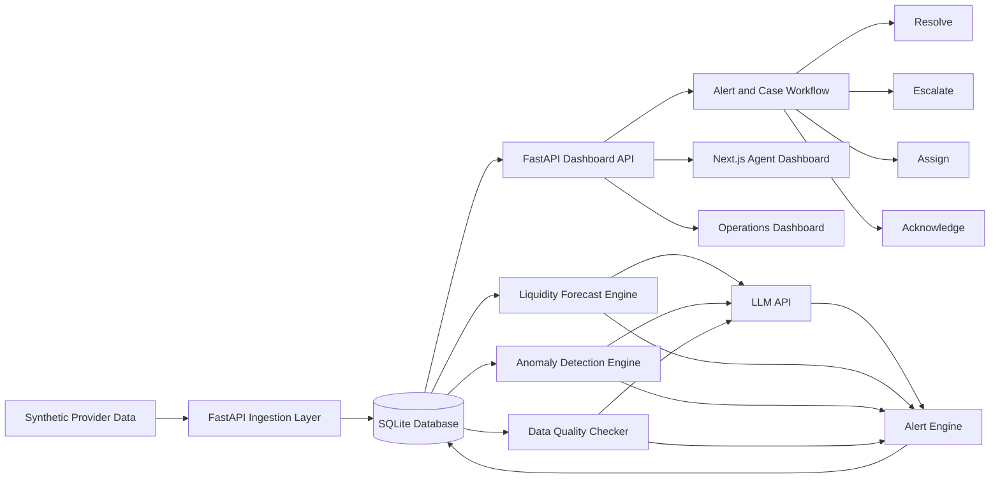

# Super Agent Liquidity & Risk Intelligence Platform

## Full Technical and Implementation Report

**Event:** Codex Community Hackathon — SUST CSE Carnival 2026  
**Challenge Theme:** Multi-provider liquidity visibility, unusual-activity detection, and safe operational coordination  
**Recommended Prototype Type:** Responsive web application  
**Recommended Team Size:** 3 people  
**Recommended Hackathon Scope:** End-to-end working prototype using synthetic data only

---

## 1. Executive Summary

Mobile financial service agents often serve customers through multiple providers such as bKash, Nagad, and Rocket. Although the agent uses one shared pool of physical cash, each provider maintains a separate electronic balance. This creates an operational problem: the agent may appear financially healthy when all balances are viewed together, while one provider balance or the shared cash reserve is actually close to running out.

The proposed solution is a **Super Agent Liquidity & Risk Intelligence Platform** that provides:

- A unified view of shared physical cash and provider-specific balances
- Forward-looking liquidity forecasting
- Explainable unusual-activity detection
- Data-quality and confidence indicators
- Human-review workflows
- Alert ownership, acknowledgement, escalation, and resolution tracking
- Bangla, Banglish, or English explanations
- Safe recommendations without executing financial transactions

The system is strictly a **decision-support prototype**. It does not connect to real wallets, move funds, block users, expose customer identities, or make final fraud decisions.

---

## 2. Problem Understanding

### 2.1 Core operational problem

A multi-provider agent has:

- One shared physical cash reserve
- Separate bKash e-money balance
- Separate Nagad e-money balance
- Separate Rocket e-money balance
- Different transaction demand patterns for each provider

The agent may have enough total value overall, but still be unable to serve customers because:

- One provider balance is nearly empty
- Shared physical cash is decreasing rapidly
- One provider experiences an abnormal demand spike
- Provider feeds are delayed or conflicting
- Unusual transactions require human review
- Nobody clearly owns the operational response

### 2.2 Example situation

Suppose an agent has:

| Resource | Balance |
|---|---:|
| Shared physical cash | ৳80,000 |
| bKash balance | ৳18,000 |
| Nagad balance | ৳75,000 |
| Rocket balance | ৳42,000 |

The total amount appears healthy. However, bKash cash-out demand is ৳10,000 per hour. At that rate, the bKash balance may run out in less than two hours.

At the same time, the system detects:

- Eleven similar cash-out requests
- Several requests from a small group of simulated accounts
- A sudden increase in bKash cash-out volume
- Delayed data from another provider

The prototype must explain the situation, estimate the risk, lower confidence when data is unreliable, assign an owner, and support human review.

---

## 3. Project Objectives

### 3.1 Primary objectives

The prototype should:

1. Show shared physical cash and provider-specific balances together
2. Predict provider-level and shared-cash shortages
3. Detect at least one unusual transaction pattern
4. Explain why the activity was flagged
5. Show confidence and uncertainty
6. Support alert routing and case ownership
7. Support acknowledgement, assignment, escalation, and resolution
8. Preserve provider separation
9. Use synthetic or mock data only
10. Provide measurable engineering and analytical evidence

### 3.2 Secondary objectives

The prototype may also:

- Support multiple agents
- Support area-wise filtering
- Support provider-wise filtering
- Display Bangla or Banglish alerts
- Show nearby-agent support suggestions
- Show hotspots
- Support what-if simulations
- Support audit trails and reviewer notes

---

## 4. Scope

### 4.1 In scope

- Simulated agents
- At least two logically separate providers
- Shared physical cash
- Provider-specific electronic balances
- Synthetic transactions
- Liquidity forecasting
- Unusual-activity detection
- Data-quality monitoring
- Explainable alerts
- Human-review workflow
- Alert history
- Case ownership and escalation
- Dashboard and reporting
- Validation metrics

### 4.2 Out of scope

- Real bKash, Nagad, Rocket, or banking integrations
- Real customer identities
- Real customer balances
- PINs, OTPs, passwords, or credentials
- Real settlement
- Automatic wallet refill
- Automatic fund transfer
- Blocking or freezing accounts
- Final fraud determination
- Regulatory or production-readiness claims

---

## 5. Intended Users and Access

> Role-based access control is listed as a future enhancement (see Section 29) rather than a mandatory build item. The subsections below define the **target design** for who each role is and what they should see and do, so the team has a concrete reference even if login/permissions are simplified (e.g. a single role-selector) for the hackathon build.

### 5.1 Users at a Glance

| User | Main need |
|---|---|
| Multi-provider agent | Understand cash position, provider pressure, and recommended next steps |
| Field or territory officer | Review alerts, contact agents, coordinate support, and update case status |
| Provider operations team | Monitor assigned agents and provider-specific risk |
| Risk or compliance analyst | Review evidence and unusual patterns without treating them as proof of fraud |
| Management | View area-level service risk and operational readiness |
| Customers | Receive more reliable service |

The hierarchy implied on the operations side is:

```text
Agent / Outlet
  → Field or Territory Officer
    → Area / Thana / District Manager
      → Central Provider Operations Team
```

For the prototype, the Field Officer and Provider Operations rows can represent this entire chain; a separate screen per hierarchy level is not required.

### 5.2 Role-by-Role: Access and Dashboard After Login

**Multi-Provider Agent**
- *Can do:* view own outlet's shared cash and all provider balances; view own transactions and forecasts; view own active alerts/cases (read-only — cannot resolve or escalate); cannot see other agents' data.
- *Sees on login:* shared cash card; per-provider balance cards; burn rate and estimated runway per provider; risk status and confidence score for the outlet; recent cash-in/cash-out activity; any open alerts with plain-language explanation and recommended safe action; data-freshness indicator.

**Field or Territory Officer**
- *Can do:* view alerts for agents in their assigned area; contact or flag an agent; acknowledge an alert; assign a case; update status and add notes; escalate to Risk/Compliance; cannot cross provider boundaries into data they aren't scoped to.
- *Sees on login:* filterable alert queue (provider, agent, area, severity, owner, status, time range); alert detail view (title, type, provider, agent, severity, confidence, evidence, possible normal explanation, recommended action, status, timeline, notes); agents in their territory with current risk level; case timeline for cases they own.

**Provider Operations Team**
- *Can do:* monitor only the agents/balances assigned to their own provider; review provider-specific alerts; coordinate approved support (no real fund movement); escalate within their own provider's chain; cannot view another provider's confidential balances, alerts, or case data.
- *Sees on login:* the same style of queue as the Field Officer, filtered to their provider only; provider-level feed health (delayed, missing, or conflicting data warnings); agents currently under pressure for that provider; alerts routed to their provider's queue.

**Risk or Compliance Analyst**
- *Can do:* review evidence behind escalated alerts; add reviewer notes; change case status (e.g. mark reviewed, request more data); cannot issue a final fraud determination or trigger blocking/freezing.
- *Sees on login:* queue of escalated cases only; full evidence trail per alert (rule fired, reason, confidence score, data-quality caveats); the possible normal explanation shown alongside every flag; case history and audit log; no raw customer identities (none exist in the system — synthetic data only).

**Management**
- *Can do:* view aggregated, cross-provider, cross-agent risk posture and recurring problem areas; cannot act on individual alerts (no acknowledge, assign, or resolve) — an oversight and reporting role, not a working queue.
- *Sees on login:* area-level service risk summary; operational readiness indicators; alert volume trends, resolution times, escalation rates; the validation/metrics page (precision, shortage-detection lead time, false-positive rate, alert explanation coverage, API latency); no transaction-level drill-down required.

**Customers**
- Not a logged-in user of the system. No customer identities, login, or customer-facing screen exist — explicitly out of scope. Their only relationship to the platform is receiving more reliable service as a downstream effect of agents and operations managing liquidity and risk well.

### 5.3 Permissions Matrix

| Capability | Agent | Field Officer | Provider Ops | Risk/Compliance | Management |
|---|:---:|:---:|:---:|:---:|:---:|
| View own outlet's shared cash and balances | Yes | Yes (their area) | Yes (their provider only) | Via escalated case only | Yes (aggregated) |
| View other agents/outlets | No | Yes (in territory) | Yes (their provider's agents) | Yes (escalated only) | Yes (all) |
| View another provider's internal data | No | No | No | No | Yes (aggregated, not raw) |
| Acknowledge alert | No | Yes | Yes | — | No |
| Assign case | No | Yes | Yes | Yes (within their queue) | No |
| Escalate case | No | Yes | Yes | Yes | No |
| Resolve case | No | Yes | Yes | Yes | No |
| Add reviewer or case notes | No | Yes | Yes | Yes | No |
| Make final fraud determination | No | No | No | No | No |
| Execute real financial action | No | No | No | No | No |
| View metrics/validation dashboard | No | Limited | Limited | Yes | Yes (full) |

No role, including Risk or Compliance, makes a final fraud determination inside the tool. The platform stops at decision support and explicitly does not accuse or act automatically.

### 5.4 Cross-Cutting Guardrails

These apply to every role without exception:

- No role can trigger real settlement, transfer, refund, or wallet freeze; synthetic data only.
- No role can view another provider's confidential balances or alerts unless routed to them through the coordination workflow — never a raw cross-provider merge.
- No PINs, OTPs, passwords, or real customer identities exist anywhere in the system.
- Every alert shown to any role carries its confidence score and a possible normal explanation, so an anomaly score is never read as proof.
- When provider data is delayed, missing, or conflicting, every role sees reduced confidence or a fallback state rather than a falsely confident number.

### 5.5 Suggested Login Landing Pages

| Role | Landing route (suggested) |
|---|---|
| Agent | `/agent/dashboard` |
| Field Officer | `/ops/queue?scope=area` |
| Provider Ops | `/ops/queue?scope=provider` |
| Risk/Compliance | `/review/escalated` |
| Management | `/metrics/overview` |

If time is short, a single role selector on login (dropdown: Agent / Field Officer / Provider Ops / Risk Analyst / Management) that filters the same underlying dashboard components is a reasonable shortcut for the demo — the evaluation criteria in Section 13 of the hackathon brief weight "clarity of user roles and coordination responsibilities" as part of problem understanding, not a production-grade auth system.

---

## 6. Proposed Solution

The proposed platform contains five main capabilities.

### 6.1 Unified liquidity dashboard

The dashboard displays:

- Shared physical cash
- Balance for each provider
- Recent cash-in volume
- Recent cash-out volume
- Current net burn rate
- Estimated shortage time
- Risk level
- Confidence score
- Data freshness
- Active alerts

### 6.2 Liquidity forecasting

The system estimates when a provider balance or shared cash reserve may become insufficient.

For provider e-money:

```text
Net provider consumption rate
= cash-out demand per hour
- cash-in replenishment per hour
```

```text
Estimated provider runway
= current provider balance
/ net provider consumption rate
```

For shared physical cash:

```text
Shared cash change
= cash received from cash-in
- cash paid during cash-out
```

The forecast uses recent rolling windows, such as the last 30 or 60 minutes.

### 6.3 Explainable anomaly detection

The system detects unusual activity using transparent rules.

Recommended rules:

- Transaction velocity spike
- Repeated or near-identical amounts
- High-value transactions
- Sudden provider-level demand spike
- Transaction splitting
- Balance inconsistencies
- Unusual failure rate
- Time-based anomaly

### 6.4 Data-quality and confidence handling

The system lowers confidence when:

- Provider data is delayed
- Provider data is missing
- Conflicting balances are reported
- Too few transactions are available
- Demand changes too rapidly
- Data freshness exceeds a threshold

### 6.5 Alert and case workflow

Each important alert moves through a traceable workflow.

```text
NEW
  ↓
ACKNOWLEDGED
  ↓
ASSIGNED
  ↓
UNDER_REVIEW
  ↓
RESOLVED
```

Alternative branch:

```text
UNDER_REVIEW
  ↓
ESCALATED
  ↓
RESOLVED
```

### 6.6 LLM-powered prediction, risk, and alert layer

An LLM (called via API, e.g. Claude or an equivalent hosted model) is used as a **reasoning and language layer on top of the deterministic engines**, not as a replacement for them. The rolling-window forecast, the rule-based anomaly detector, and the confidence calculation (Sections 10–11) remain the source of truth for every number shown in the product. The LLM's job is to read those structured outputs and turn them into judgment support and natural language — it never independently decides a risk level, a fraud outcome, or a financial action.

This keeps the design consistent with the challenge's core constraint: risk signals are advisory, and no automated system may make a final fraud determination or trigger a financial action.

**Where the LLM is used:**

| Area | LLM feature | Input (from deterministic engine) | Output |
|---|---|---|---|
| Predictive / forecasting | Forecast narrative generator | Burn rate, runway, risk level, confidence, provider | Plain-language shortage explanation in Bangla, Banglish, or English (e.g. Section 25.1) |
| Predictive / forecasting | What-if scenario assistant | User question + current forecast state, via function-calling into the forecasting engine | Answer such as "if bKash demand doubles, runway drops to ~45 minutes" |
| Risk management | Case risk narrative | Alert evidence, agent history, data-quality flags | A synthesized summary for the case owner: what changed, why it matters, what is still uncertain |
| Risk management | Handoff summary | Case notes, timeline, prior owner actions | A short summary an escalated case arrives with, so the Risk/Compliance Analyst does not re-read the raw timeline |
| Alerts | Alert explanation generator | Rule-fired evidence (e.g. "11 near-identical transactions from 3 accounts") | The alert's title, explanation, and evidence text shown in Section 9.3 |
| Alerts | Possible-normal-explanation generator | Evidence + context signals (day of week, holiday calendar, historical baseline for that agent) | The "possible normal explanation" field (e.g. Eid demand), shown alongside every flag |
| Anomaly detection | Contextual plausibility layer (secondary, non-authoritative) | Same evidence used by the rule engine | A plausibility comment and adjustment to the confidence label — cannot override a flag, only annotate it |

**Design safeguards specific to the LLM layer:**

- The LLM only ever receives structured, synthetic, non-identifying data (agent IDs, provider IDs, amounts, timestamps, rule names) — never any field that would resemble a real credential or real customer identity.
- Every LLM response is validated against a fixed schema (e.g. `{title, explanation, possible_normal_explanation, recommended_action}`) before being shown; a malformed or empty response falls back to a template-based version of the same fields so the demo never breaks on an API hiccup.
- The LLM's contextual plausibility output can lower or raise displayed confidence, but it cannot clear a flag, resolve a case, or suppress an alert — those remain human actions per the workflow in Section 6.5.
- Prompts are logged alongside the alert/case audit trail (Section 14.8) so the reasoning behind any AI-generated text is traceable, consistent with the auditability requirement in Section 8's non-functional expectations.
- If the LLM API is slow or unavailable, the dashboard shows the deterministic numeric output immediately and fills in the narrative once the response returns (or falls back to templates) — the numbers are never blocked on the LLM call.

---

## 7. Recommended Technology Stack

### 7.1 Final stack

| Layer | Technology |
|---|---|
| Frontend | Next.js with TypeScript |
| UI styling | Tailwind CSS |
| UI components | shadcn/ui |
| Charts | Recharts |
| Backend | FastAPI |
| Validation | Pydantic |
| ORM | SQLAlchemy |
| Database | SQLite |
| Data analysis | pandas and NumPy |
| Optional ML | scikit-learn Isolation Forest |
| LLM reasoning layer | Hosted LLM API (e.g. Claude API) called from the backend for forecast narratives, risk/case summaries, alert explanations, and contextual plausibility (Section 6.6) |
| Testing | pytest and FastAPI TestClient |
| Synthetic data | Python generator and CSV seed files |
| Local orchestration | Docker Compose or two local processes |
| Version control | GitHub |

### 7.2 Why this stack

#### Next.js

Next.js is suitable because it provides:

- Fast dashboard development
- TypeScript support
- File-based routing
- Reusable layouts
- Responsive design
- Easy API integration
- Good presentation quality

#### FastAPI

FastAPI is suitable because it provides:

- High development speed
- Python analytics compatibility
- Automatic API documentation
- Built-in validation through Pydantic
- Simple asynchronous endpoints
- Easy testing

#### SQLite

SQLite is suitable for the hackathon because it:

- Requires no database server
- Is easy to bundle
- Works well with synthetic data
- Supports alerts, cases, transactions, and audit logs
- Reduces setup time

#### pandas and NumPy

These are suitable for:

- Rolling transaction windows
- Provider-level aggregation
- Burn-rate calculation
- Forecast generation
- Metric computation
- Synthetic validation

#### Rule-based anomaly detection

Rule-based detection should be the main method because it is:

- Explainable
- Easy to validate
- Fast to implement
- Easy to demonstrate
- Safer than an opaque score

#### Isolation Forest

Isolation Forest may be added as a secondary score, but it should not replace the evidence-based explanation.

#### LLM API

A hosted LLM is used as the reasoning and language layer described in Section 6.6, because it provides:

- Fast generation of Bangla, Banglish, or English explanations without hand-writing every template
- A meaningful, demonstrable use of AI, satisfying the "AI, APIs, analytics, or data processing as a meaningful part of the product" requirement
- The ability to summarize a case timeline for handoff between roles
- Contextual plausibility reasoning (e.g. recognizing a pre-Eid demand pattern) without hardcoding every seasonal rule
- A layer that can be schema-validated and fall back safely, so it never becomes a single point of failure for the numeric outputs

It is kept secondary to the rule-based engine for anomaly detection specifically, since an opaque model should never be the reason a case is flagged — only the reason it is explained.

---

## 8. High-Level Architecture



### 8.1 Main components

#### Frontend

- Overview dashboard
- Agent details
- Alert details
- Operations queue
- Case timeline
- Data-quality panel
- Metrics page

#### Backend

- Transaction ingestion
- Liquidity calculation
- Anomaly detection
- LLM reasoning service (forecast narratives, case summaries, alert explanations, contextual plausibility)
- Alert generation
- Alert workflow
- Data-quality checks
- Metrics endpoints
- Simulation endpoints

#### Database

- Agents
- Providers
- Provider balances
- Transactions
- Alerts
- Case events
- Audit logs
- Data-feed status

---

## 9. Functional Modules

## 9.1 Overview dashboard

The overview page should contain:

- Shared cash card
- Total provider balances
- At-risk providers
- Open alerts
- Provider feed health
- Estimated runway chart
- High-priority alert table
- Recent case activity

Example:

| Resource | Current balance | Burn rate | Estimated runway | Status |
|---|---:|---:|---:|---|
| Shared cash | ৳80,000 | ৳12,000/hour | 6h 40m | Healthy |
| bKash | ৳18,000 | ৳10,000/hour | 1h 48m | High pressure |
| Nagad | ৳75,000 | ৳4,000/hour | 18h 45m | Healthy |
| Rocket | ৳42,000 | ৳3,500/hour | 12h | Healthy |

## 9.2 Agent details

The agent page should show:

- Agent identity
- Area
- Shared physical cash
- Provider balances
- Recent transactions
- Provider forecasts
- Current risk status
- Confidence score
- Last feed update
- Active cases

## 9.3 Alert details

Each alert should show:

- Alert title
- Alert type
- Provider
- Agent
- Severity
- Confidence
- Evidence
- Explanation
- Possible normal explanation
- Recommended safe action
- Assigned owner
- Current status
- Timeline
- Notes

Example:

```text
Requires review

Reasons:
- Cash-out volume is 2.8 times the normal level.
- Eleven transactions had nearly identical amounts.
- Seventy-two percent came from three simulated accounts.

Possible normal explanation:
- Eid-related demand spike.

Recommended action:
- Contact the agent and review the transactions before arranging a large cash supply.
```

## 9.4 Operations queue

Operations users should be able to filter alerts by:

- Provider
- Agent
- Area
- Severity
- Owner
- Status
- Time range

## 9.5 Data-quality panel

The panel should show:

- Feed delayed
- Feed missing
- Balance conflict
- Last successful update
- Confidence reduction
- Fallback recommendation

---

## 10. Liquidity Forecasting Design

### 10.1 Rolling-window calculation

For each provider:

```text
cash_out_rate
= total cash-out amount in selected window
/ window duration
```

```text
cash_in_rate
= total cash-in amount in selected window
/ window duration
```

```text
net_consumption_rate
= cash_out_rate - cash_in_rate
```

```text
estimated_runway
= current_balance / net_consumption_rate
```

If the net consumption rate is zero or negative, the provider is not currently moving toward shortage.

### 10.2 Shared cash forecasting

```text
shared_cash_outflow
= total cash paid during cash-out
```

```text
shared_cash_inflow
= total cash received during cash-in
```

```text
shared_cash_burn_rate
= shared_cash_outflow - shared_cash_inflow
```

```text
shared_cash_runway
= current_shared_cash / shared_cash_burn_rate
```

### 10.3 Risk levels

| Risk level | Example condition |
|---|---|
| Critical | Estimated shortage within 30 minutes |
| High | Estimated shortage within 2 hours |
| Medium | Estimated shortage within 6 hours |
| Low | Estimated shortage beyond 6 hours |
| Unknown | Data quality too low for a reliable estimate |

### 10.4 Confidence score

A simple confidence model may start at 1.0 and apply penalties.

Example:

```text
confidence = 1.0
```

Penalties:

- Missing provider feed: -0.40
- Feed delayed beyond threshold: -0.20
- Conflicting balance reports: -0.25
- Fewer than 10 recent transactions: -0.15
- Highly volatile demand: -0.10

The final score should be limited to the range 0.0 to 1.0.

### 10.5 LLM-generated forecast narrative

Once the numeric forecast (runway, burn rate, risk level, confidence) is computed above, it is passed to the LLM API as structured input to produce the natural-language version shown on the dashboard and in alerts (see Section 6.6 and the Bangla examples in Section 25.1). The LLM does not alter or re-derive any of these numbers — it only phrases them. If the API call fails or times out, the dashboard falls back to a simple template, e.g.:

```text
{provider} balance may run out in about {runway}.
Confidence: {confidence}%.
```

---

## 11. Anomaly Detection Design

### 11.1 Transaction velocity rule

```text
current_10_minute_count
> 2.5 × historical_10_minute_average
```

Evidence shown:

- Current count
- Baseline count
- Difference
- Time window

### 11.2 Repeated amount rule

Example condition:

```text
At least 8 transactions
within ±1% amount range
during 15 minutes
```

Evidence shown:

- Number of transactions
- Amount range
- Provider
- Simulated account count

### 11.3 High-value transaction rule

```text
transaction_amount
> historical_mean + 3 × standard_deviation
```

Evidence shown:

- Current amount
- Historical average
- Threshold
- Provider context

### 11.4 Provider-demand spike rule

```text
current_provider_cash_out
> 2 × provider_baseline
```

Evidence shown:

- Current provider volume
- Historical provider volume
- Other provider comparison
- Time period

### 11.5 Optional Isolation Forest

Suggested features:

- Amount
- Transactions per minute
- Time since previous transaction
- Repeated-amount ratio
- Cash-out to cash-in ratio
- Provider balance change
- Failure rate

The ML score must be presented only as supporting evidence.

### 11.6 LLM contextual plausibility layer (secondary)

After a rule in 11.1–11.4 fires (and optionally after the Isolation Forest score is computed), the evidence is passed to the LLM API to generate the "possible normal explanation" shown alongside the flag — for example, recognizing that a volume spike coincides with a pre-Eid period or a salary date. This step:

- Runs only after a flag already exists; it cannot create a flag on its own
- May adjust the displayed confidence label (e.g. from "requires review" toward "likely normal, review recommended") but cannot clear the case or remove it from the queue
- Always shows its reasoning as text, not just a score, so a human reviewer can agree or disagree with it
- Falls back to "no additional context available" if the API call fails, leaving the rule-based flag and its evidence fully intact

---

## 12. Alert Model

Example alert object:

```json
{
  "alert_id": "ALT-1042",
  "type": "LIQUIDITY_AND_UNUSUAL_ACTIVITY",
  "provider": "bKash",
  "agent_id": "AG-017",
  "severity": "high",
  "confidence": 0.81,
  "title": "bKash liquidity pressure requires review",
  "reason": [
    "Cash-out demand increased by 38 percent",
    "Repeated near-identical amounts were detected",
    "Most requests came from three simulated accounts"
  ],
  "possible_normal_explanation": "Eid-related demand spike",
  "recommended_action": "Contact the agent and review the transactions",
  "status": "assigned",
  "owner": "Territory Officer 3",
  "created_at": "2026-07-11T14:10:00"
}
```

`type`, `provider`, `agent_id`, `severity`, `confidence`, and `status` are produced entirely by the deterministic forecasting and rule engines (Sections 10–11). `title`, the human-readable `reason` text, `possible_normal_explanation`, and `recommended_action` are generated by the LLM API from that structured evidence, per Section 6.6 — the LLM writes the sentence, it does not decide the severity or confidence number behind it.

### 12.1 Careful language

Use:

- Unusual activity
- Requires review
- Elevated liquidity pressure
- Data inconsistency
- Low-confidence estimate
- Possible demand spike

Do not use:

- Fraud confirmed
- Criminal activity
- Block account
- Freeze wallet
- Transfer funds automatically

---

## 13. Case Workflow

### 13.1 Recommended status model

| Status | Meaning |
|---|---|
| New | Alert was generated |
| Acknowledged | Someone has seen the alert |
| Assigned | A responsible owner was selected |
| Under review | Evidence is being reviewed |
| Escalated | The case was forwarded to a higher authority |
| Resolved | The operational issue was closed |
| Dismissed | The alert was reviewed and considered non-actionable |

### 13.2 Example timeline

```text
2:10 PM — Alert generated
2:12 PM — Acknowledged by operations officer
2:14 PM — Assigned to territory officer
2:19 PM — Agent contacted
2:23 PM — Escalated for risk review
2:35 PM — Demand confirmed as Eid-related
2:39 PM — Case resolved
```

---

## 14. Database Design

## 14.1 agents

```text
id
name
area
shared_cash
status
created_at
updated_at
```

## 14.2 providers

```text
id
name
code
status
```

## 14.3 agent_provider_balances

```text
id
agent_id
provider_id
opening_balance
current_balance
updated_at
data_status
```

## 14.4 transactions

```text
id
agent_id
provider_id
simulated_customer_id
transaction_type
amount
status
timestamp
```

## 14.5 alerts

```text
id
agent_id
provider_id
alert_type
severity
confidence
title
explanation
recommended_action
status
owner
created_at
updated_at
```

## 14.6 case_events

```text
id
alert_id
event_type
actor
note
timestamp
```

## 14.7 provider_feed_status

```text
id
provider_id
agent_id
last_received_at
status
delay_seconds
conflict_detected
```

## 14.8 audit_logs

```text
id
actor
action
entity_type
entity_id
metadata
timestamp
```

---

## 15. API Design

### 15.1 Dashboard endpoints

```text
GET /api/dashboard/summary
GET /api/dashboard/provider-risk
GET /api/dashboard/feed-health
```

### 15.2 Agent endpoints

```text
GET /api/agents
GET /api/agents/{agent_id}
GET /api/agents/{agent_id}/balances
GET /api/agents/{agent_id}/liquidity
GET /api/agents/{agent_id}/transactions
GET /api/agents/{agent_id}/alerts
```

### 15.3 Alert endpoints

```text
GET  /api/alerts
GET  /api/alerts/{alert_id}
POST /api/alerts/{alert_id}/acknowledge
POST /api/alerts/{alert_id}/assign
POST /api/alerts/{alert_id}/escalate
POST /api/alerts/{alert_id}/resolve
POST /api/alerts/{alert_id}/dismiss
```

### 15.4 Simulation endpoints

```text
POST /api/simulation/run?scenario=hidden-shortage
POST /api/simulation/run?scenario=unusual-activity
POST /api/simulation/run?scenario=delayed-provider-data
POST /api/simulation/run?scenario=balance-conflict
POST /api/simulation/reset
```

### 15.5 Metrics endpoints

```text
GET /api/metrics/analytics
GET /api/metrics/performance
GET /api/metrics/reliability
```

### 15.6 LLM endpoints

```text
POST /api/forecast/{agent_id}/narrative
POST /api/alerts/{alert_id}/explain
POST /api/alerts/{alert_id}/plausibility
POST /api/cases/{case_id}/summarize
POST /api/cases/{case_id}/handoff-summary
```

Each of these takes the already-computed structured output (forecast numbers, rule evidence, or case timeline) as input and returns LLM-generated text validated against a fixed schema, per Section 6.6. None of these endpoints accept or return a risk decision, a fraud determination, or an instruction to move funds — they return explanatory text only.

---

## 16. Frontend Structure

### 16.1 Suggested navigation

```text
Overview
Agents
Alerts
Cases
Analytics
Data Quality
Metrics
```

### 16.2 Suggested page layout

```text
Sidebar
├── Overview
├── Agents
├── Alerts
├── Cases
├── Analytics
├── Data Quality
└── Metrics
```

### 16.3 Overview layout

```text
Top row:
[Shared Cash] [At-Risk Providers] [Open Alerts] [Feed Health]

Middle:
[Provider Balance Chart] [Estimated Runway Chart]

Bottom:
[High-Priority Alerts] [Recent Case Activity]
```

### 16.4 Visual principles

- Use clear provider labels
- Do not rely only on color
- Show text severity labels
- Show confidence percentages
- Show timestamps
- Show warning icons
- Keep critical actions visible
- Preserve provider boundaries

---

## 17. Synthetic Data Design

### 17.1 Required entities

- 10 to 50 agents
- 2 to 3 providers
- Multiple areas
- Shared cash values
- Provider balances
- Cash-in and cash-out transactions
- Successful and failed transactions
- Simulated customer IDs
- Provider feed timestamps
- Alert and case history

### 17.2 Normal scenarios

- Normal weekday activity
- Salary-day demand
- Eid-related demand spike
- Balanced cash-in and cash-out
- Gradual provider usage growth

### 17.3 Injected anomaly scenarios

- Repeated near-identical transactions
- Sudden cash-out spike
- High-value transaction burst
- Transaction splitting
- Delayed provider feed
- Conflicting provider balance
- Abnormal failure rate
- Provider-specific hidden shortage

### 17.4 Data generation approach

1. Generate baseline demand by provider
2. Add time-of-day variation
3. Add event-based demand multipliers
4. Update balances after each transaction
5. Inject known anomalies
6. Store ground-truth labels for validation

---

## 18. Validation and Metrics

At least three metrics should be measured.

### 18.1 Shortage detection lead time

```text
Lead time
= actual shortage time
- detected shortage time
```

Suggested target:

```text
30 to 120 minutes before shortage
```

### 18.2 Anomaly precision

```text
Precision
= true positives
/ (true positives + false positives)
```

Suggested target:

```text
Above 80 percent
```

### 18.3 Anomaly recall

```text
Recall
= true positives
/ (true positives + false negatives)
```

Suggested target:

```text
Above 75 percent
```

### 18.4 False-positive rate

```text
False-positive rate
= false positives
/ total normal cases
```

Suggested target:

```text
Below 15 percent
```

### 18.5 Explanation coverage

```text
Explanation coverage
= alerts with reason, evidence, and uncertainty
/ total alerts
```

Suggested target:

```text
100 percent
```

### 18.6 API latency

Suggested target:

```text
Average response time below 250 ms
p95 response time below 500 ms
```

### 18.7 Data-quality detection

Suggested target:

```text
100 percent of injected missing or delayed feeds detected
```

---

## 19. Testing Strategy

### 19.1 Unit tests

Test:

- Burn-rate calculation
- Runway calculation
- Confidence penalties
- Velocity spike detection
- Repeated amount detection
- High-value threshold
- Alert severity mapping
- Status transitions

### 19.2 API tests

Test:

- Dashboard summary
- Agent details
- Alert filtering
- Acknowledge action
- Assign action
- Escalate action
- Resolve action
- Simulation trigger

### 19.3 Reliability tests

Test:

- Missing provider feed
- Delayed provider feed
- Conflicting provider balance
- Empty transaction window
- Negative or zero burn rate
- Duplicate transactions
- Database restart

### 19.4 Frontend tests

Test:

- Dashboard loading
- Empty state
- Error state
- Alert details
- Filter behavior
- Status updates
- Responsive layout

---

## 20. Security, Privacy, and Responsible Design

### 20.1 Security principles

- Use synthetic identifiers
- Do not store real credentials
- Do not collect PINs or OTPs
- Do not use real provider APIs
- Keep provider data logically separated
- Validate all API inputs
- Log important workflow actions

### 20.2 Privacy principles

- Use fake customer IDs
- Avoid names, phone numbers, and account numbers
- Use only necessary transaction fields
- Document all synthetic-data assumptions

### 20.3 Responsible AI principles

- An anomaly is not proof of fraud
- Every important alert must show evidence
- Human review is required
- Show uncertainty
- Show possible normal explanations
- Do not automate financial actions
- Do not make unsupported accusations

### 20.4 LLM-specific principles

- The LLM (Section 6.6) is a language and reasoning layer, never a decision-maker; the numeric risk level, confidence score, and case status always come from the deterministic engines in Sections 10–11
- The LLM never receives real customer data, credentials, or anything beyond synthetic IDs, amounts, timestamps, and rule names
- Every LLM response is schema-validated before display; malformed or failed responses fall back to a template, never to a blank or broken alert
- LLM-generated text is labeled distinctly from deterministic values in the data model (Section 12) so it is clear which parts of an alert are computed and which are phrased
- Prompts and responses used to generate case-facing text are logged to the audit trail (Section 14.8) for traceability

---

## 21. Recommended Project Structure

```text
super-agent-platform/
├── frontend/
│   ├── app/
│   ├── components/
│   ├── lib/
│   ├── types/
│   └── public/
│
├── backend/
│   ├── app/
│   │   ├── api/
│   │   ├── models/
│   │   ├── schemas/
│   │   ├── services/
│   │   ├── analytics/
│   │   ├── database/
│   │   └── main.py
│   ├── tests/
│   └── requirements.txt
│
├── data/
│   ├── agents.csv
│   ├── providers.csv
│   ├── transactions.csv
│   └── scenarios/
│
├── scripts/
│   ├── generate_data.py
│   ├── seed_database.py
│   └── evaluate_models.py
│
├── docs/
│   ├── architecture.md
│   ├── data_simulation.md
│   ├── responsible_design.md
│   └── validation.md
│
├── docker-compose.yml
├── README.md
└── .env.example
```

---

## 22. Three-Person Team Plan

### Person 1 — Frontend developer

Responsibilities:

- Next.js setup
- Dashboard layout
- Components
- Charts
- Agent page
- Alert page
- Case timeline
- API integration

### Person 2 — Backend developer

Responsibilities:

- FastAPI setup
- Database models
- API endpoints
- Alert workflow
- Simulation endpoints
- Persistence
- Testing

### Person 3 — Data and analytics developer

Responsibilities:

- Synthetic data generator
- Liquidity forecasting
- Anomaly detection
- Confidence model
- Evaluation metrics
- Scenario validation

---

## 23. Four-Hour Execution Plan

### Hour 1 — Setup and contracts

#### All members

- Agree on final scope
- Define JSON response formats
- Define database schema
- Define required screens
- Create GitHub repository
- Create branches

#### Frontend

- Set up Next.js
- Build dashboard skeleton
- Add sidebar and routing

#### Backend

- Set up FastAPI
- Set up SQLite and SQLAlchemy
- Create core models

#### Analytics

- Create synthetic data format
- Implement initial data generator
- Define forecast output schema

### Hour 2 — Core implementation

#### Frontend

- Build summary cards
- Build provider table
- Build alerts list
- Build alert details page

#### Backend

- Implement agent and dashboard APIs
- Implement alert workflow APIs
- Add seed-data loader

#### Analytics

- Implement liquidity forecasting
- Implement repeated-amount rule
- Implement velocity-spike rule
- Implement confidence calculation

### Hour 3 — Integration and scenarios

#### All members

- Connect frontend to backend
- Fix response mismatches
- Add error states
- Add scenario triggers

#### Required demo scenarios

- Hidden provider shortage
- Liquidity pressure with unusual activity
- Delayed provider feed
- Coordinated response and closure

### Hour 4 — Validation and presentation

#### All members

- Run tests
- Capture metrics
- Prepare architecture diagram
- Prepare demo data
- Rehearse presentation
- Prepare fallback screenshots or video
- Finish README
- Document limitations

---

## 24. Demo Story

A strong live demo should follow this story:

1. Open the overview dashboard
2. Show that the agent appears healthy overall
3. Show that the bKash balance is predicted to run out in about 90 minutes
4. Trigger an unusual-activity scenario
5. Show repeated near-identical cash-out transactions
6. Show possible normal explanation such as Eid demand
7. Show confidence and evidence
8. Assign the alert to an operations officer
9. Acknowledge the alert
10. Escalate it to a risk reviewer
11. Add a case note
12. Resolve the case
13. Show the complete audit timeline
14. Open the metrics page
15. Show measured precision, lead time, explanation coverage, and API latency

---

## 25. Bangla Alert Examples

### 25.1 Liquidity pressure

```text
বর্তমান লেনদেনের ধারা অনুযায়ী প্রায় ৯০ মিনিটের মধ্যে বিকাশ ব্যালেন্স কমে যেতে পারে।
গত ৩০ মিনিটে বিকাশ ক্যাশ-আউটের চাপ ৩৮% বেড়েছে।
বর্তমান পূর্বাভাসের নির্ভরযোগ্যতা ৮১%।

নিরাপদ পরবর্তী পদক্ষেপ:
এজেন্টের সঙ্গে যোগাযোগ করে অনুমোদিত সহায়তা প্রক্রিয়া শুরু করুন।
```

### 25.2 Unusual activity

```text
গত ১২ মিনিটে স্বাভাবিকের তুলনায় অনেক বেশি ক্যাশ-আউট হয়েছে।
১১টি লেনদেনের পরিমাণ প্রায় একই ছিল এবং বেশিরভাগ অনুরোধ তিনটি সিমুলেটেড অ্যাকাউন্ট থেকে এসেছে।

এটি ঈদ-পূর্ব স্বাভাবিক চাহিদাও হতে পারে।
বড় কোনো পদক্ষেপ নেওয়ার আগে মানব পর্যালোচনা প্রয়োজন।
```

### 25.3 Data-quality warning

```text
নাগাদ ডেটা ফিড ১৮ মিনিট দেরিতে এসেছে।
এই কারণে পূর্বাভাসের নির্ভরযোগ্যতা কমানো হয়েছে।
হালনাগাদ ডেটা না পাওয়া পর্যন্ত স্বয়ংক্রিয় সিদ্ধান্তের পরিবর্তে সতর্ক পর্যালোচনা করুন।
```

---

## 26. Required Deliverables

The team should prepare:

- Working prototype
- Source repository
- README
- Setup instructions
- Environment example
- Synthetic sample data
- Architecture diagram
- Data and simulation note
- Validation evidence
- Responsible-design note
- Final presentation
- Optional demo video

---

## 27. Submission Checklist

- [ ] At least two providers are represented separately
- [ ] Shared physical cash is displayed
- [ ] Provider-specific balances are displayed
- [ ] Forward-looking shortage insight is shown
- [ ] At least one anomaly category is demonstrated
- [ ] Evidence is shown for anomalies
- [ ] Careful risk language is used
- [ ] Human review is included
- [ ] Alert ownership is shown
- [ ] Alert acknowledgement is shown
- [ ] Escalation or assignment is shown
- [ ] Resolution status is visible
- [ ] Missing or delayed data lowers confidence
- [ ] At least three metrics are measured
- [ ] Provider boundaries are respected
- [ ] No real financial actions are executed
- [ ] README and architecture documentation are complete
- [ ] Final presentation is ready

---

## 28. Risks and Mitigation

| Risk | Mitigation |
|---|---|
| Too much scope | Build only five complete core features |
| Frontend-backend mismatch | Define JSON contracts during the first hour |
| Weak demo data | Use deterministic scenario triggers |
| Overcomplicated ML | Use explainable rules first |
| Missing metrics | Store ground-truth labels in synthetic data |
| Demo failure | Prepare reset endpoint and backup screenshots |
| Unsafe language | Use “requires review” and “unusual activity” |
| Provider confusion | Keep balances and workflows provider-specific |
| Low confidence data | Add visible feed-health status and fallback behavior |
| LLM API latency or downtime | Show deterministic numbers immediately; fall back to template text for narratives (Section 6.6, 10.5) |
| LLM hallucinated or malformed output | Validate every response against a fixed schema before display; reject and fall back on failure |
| Over-trusting LLM contextual reasoning | Keep the LLM's plausibility layer secondary and non-authoritative; it can only annotate, never clear, a flag (Section 11.6) |

---

## 29. Future Enhancements

Possible future work:

- PostgreSQL migration
- Redis caching
- Real-time WebSocket updates
- Multi-agent hotspot map
- Graph-based relationship visualization
- Nearby-agent support discovery
- More advanced forecasting
- Reviewer feedback loops
- Role-based access control
- Centralized monitoring
- OpenTelemetry tracing
- Multilingual alert generation
- Mobile agent interface
- Offline mode
- Production-grade provider adapters

These should be presented only as future possibilities, not as completed production capabilities.

---

## 30. Final Recommendation

The best hackathon submission is not the one with the most features. It is the one that demonstrates a complete, understandable, measurable, and responsible operational flow.

The recommended prototype should fully implement:

1. Unified shared-cash and provider-balance dashboard
2. Provider-level shortage prediction
3. One explainable anomaly scenario
4. Alert acknowledgement, assignment, escalation, and resolution
5. Missing or delayed-data fallback
6. At least three measured metrics

The final solution should show how a multi-provider agent can understand liquidity pressure early, review unusual activity safely, and coordinate a human response without unsafe integration, unsupported accusations, or automatic financial action.